# S-Bike Training Hub

**A free personal training companion for planning workouts, managing recovery, and working toward long-term fitness and event goals. Bring cycling, swimming, running, and lifting into one calendar, with detailed training-load estimates, projected loads, and personal check-ins to inform your next decisions.**

The Hub runs locally on your Mac, with no Hub subscription. An optional AI assistant can read your training history, help build and revise plans, and record your reports. You can also use the Coach and training tools **without a smart bike**.

For supported stationary bikes, it adds connected workouts, automatic shifting and resistance control, offline 3D routes, a phone/tablet remote, and an interactive ride experience. It began as a bike bridge and has grown into a training hub.

**The aim:** get more benefit from the work you put in, balance overlapping demands across sports, and make recovery part of the plan. The custom load and recovery models are experimental estimates being calibrated through workouts and follow-up reports; they are not validated injury predictions.

The **connected-bike feature** was built for, and has only been tested on, the **Merach S29**. Other smart bikes that speak Bluetooth FTMS may work, but we couldn't test them (see [Other bikes](#other-bikes)).

## Start with your training

- **Plan toward a goal.** Schedule sessions, including multiple sessions in a day, and organize them into a flexible program of phases, with a default 12-week starter horizon and weekly reviews.
- **See the different costs of training.** Cardiovascular load, running impact and accumulated recovery, swimming exposure, and regional lifting recovery are tracked separately. The body map shows overlapping sources of muscle demand.
- **Look ahead.** The calendar shows workout details and swim-profile rationale. Projected-load graphs group related metrics in four-card pages, with recorded history separated from forecasts.
- **Compare the plan with reality.** Import watch workouts, log lifting details, record how sessions felt, and use next-day/follow-up reports and Sunday reviews to inform adjustments.
- **Work with an AI assistant if you choose.** Local tools provide the data, templates, goals, constraints, and plan-writing actions. The assistant helps interpret and revise the plan; the Hub calculates its metrics.

## Build and review your program

Start in **Welcome** with the sports you train, experience, starting condition, available hours, and an optional event date. Choose **Easy**, **Moderate**, or **Higher** starter workload. The builder compares all three against the same baseline so you can inspect their expected load trajectories and load-limit flags.

- **12 weeks by default.** A shorter horizon or nearer event gets fewer weeks. Longer macro programs are supported; automatic detailed starter prescriptions cover at most the first 12 weeks. Later weeks require further programming.
- **Simple, editable workouts.** Steady cycling, relaxed freestyle and drills, conditional run/walk, and either bodyweight/band work or barbell squat, bench press and row with bridge/core accessories. These are starting templates, not advanced sport-specialist programs.
- **Calibration without a maximum attempt.** Start with a familiarization week or enter recent comfortable lifting sets: weight including the bar, repetitions, and repetitions left. Prefer 6–10 reps; accepted range 3–15. Missing barbell working weights must be resolved before applying those prescriptions.
- **Preview is a draft.** Review and edit phases, dates, names, colors, sport priorities, and weekly/date-specific placements without replacing your saved program. Apply explicitly from today or a future date; completed history and existing workouts are retained.
- **Horizontal saved timeline, vertical editor.** Select a phase to see its purpose and chosen week. **Weeks in this phase** opens expandable weeks and day strips; **View more** opens a program calendar with three months per row. Detailed workouts and projected-load graphs remain accessible from that calendar.
- **A single Fitness Dashboard.** Current readings, controls, calibration, recovery and watch insights share one scrolling page with translucent cards over generated landscape artwork. Progress emphasizes measured changes and the evidence behind them. Uploaded artwork stays local.

### What the three forecasts actually calculate

The three options are **workload scenarios**, mainly differing in proposed minutes, sets and modest working-load fractions. They use the same recovery and conditioning models. They are **not yet a solver that automatically finds an optimal program for a chosen load ceiling**, and higher workload does not guarantee better results. Daily limit flags require review; they are not silently optimized away.

| Training | Inputs and model used for the forecast |
|---|---|
| Cycling | Planned power steps, FTP, duration and cadence; saved workout/focus details when available |
| Swimming | Planned duration and stroke/drill mix; comparable recorded swim exposure per minute, equipment information where supported, and the existing swim recovery curve |
| Barbell starters | Reported lift-specific set → approximate Epley estimated maximum; prescribed weight, sets, reps and tempo → relative-intensity dose; regional allocation → regional recovery |
| Bodyweight / bands / holds | Exercise type, repetitions or hold duration, effort and tempo, with provisional regional allocation; body mass is not converted into invented joint forces |
| Running / walking | Available comparable activity doses, steps and existing impact/backlog models; body weight influences recorded impact scoring. Existing running restrictions remain authoritative |

For example, the existing lifting model estimates a maximum as `weight × (1 + (reps + reps_in_reserve) / 30)`, then scores relative intensity using `sets × reps × ((working_weight / estimated_max) / 0.75)²`, with side/tempo factors. Effort-based movements use repetition or hold counts and an effort factor. These **Hub score formulas are provisional heuristics**, not validated tissue-force or recovery equations. Regional percentages are qualitative allocation assumptions, not measured percentages of tendon force.

A small starter movement catalog is deliberate: squat, press, row, bridge and core families can cover basic strength training without pretending to model every exercise. Custom exercises still need appropriate scoring. Recording actual sets, effort, symptoms and delayed responses is how these assumptions can be checked and calibrated.

Recorded personal data takes precedence. Where it is missing, **neutral forecast defaults** can be enabled; the preview lists them explicitly. These are provisional scenario assumptions, not established population averages. Disable them to keep unavailable readings unknown. Forecast defaults are not written into measured history. A snapshot of the selected forecast is retained locally for later comparison with outcomes.

Research supports considering load, volume, frequency and effort when designing resistance training; it does not validate our particular block scale or tissue recovery dates. See the [2026 ACSM position stand announcement](https://acsm.org/science-spotlight-acsm-releases-new-position-stand-on-resistance-training/), [load/sets/frequency network meta-analysis](https://pmc.ncbi.nlm.nih.gov/articles/pmid/37414459/), and [proximity-to-failure meta-regressions](https://pubmed.ncbi.nlm.nih.gov/38970765/). The starter percentages and progression rules remain conservative design choices for review.

<p align="center">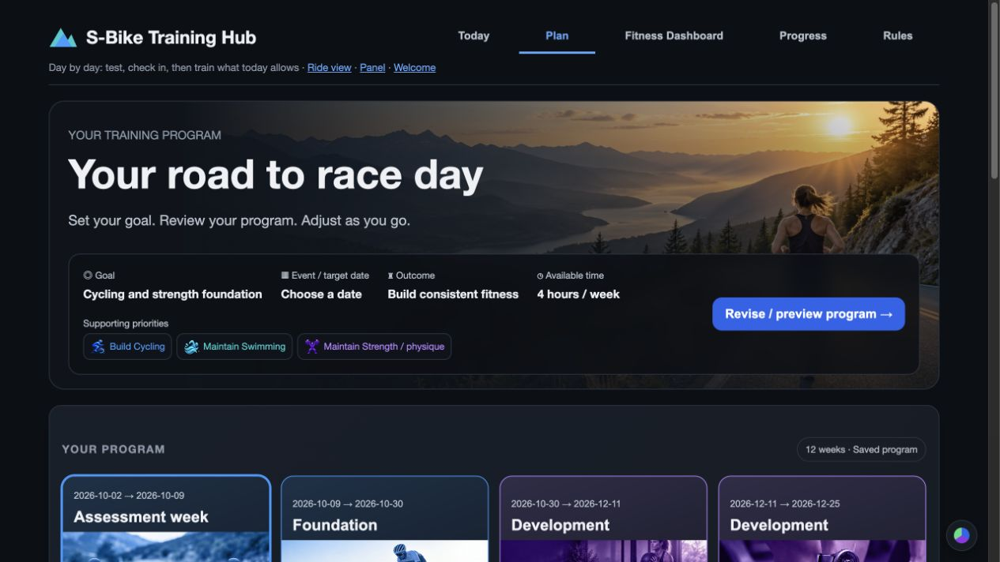</p>

<p align="center">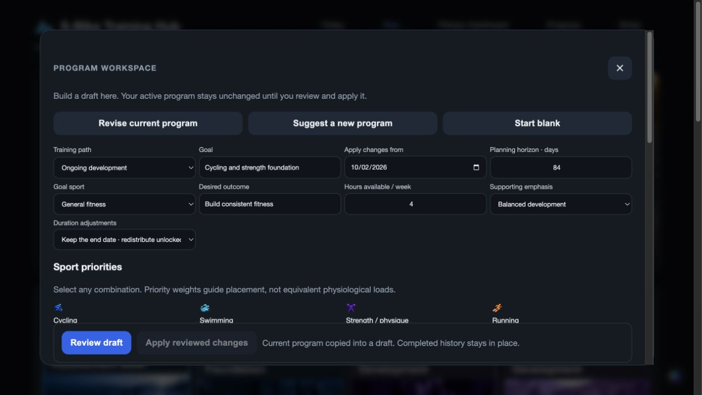</p>

*Illustrative demo program. Screenshots contain no personal training history.*

## Connected cycling

**Merach S29 owner? The bike problems this was built to fix:**
- **Only one thing can connect to the bike at a time**, so your watch can't record power and cadence while Zwift or Kinomap is connected. The hub holds the one connection and shares it with both.
- **Hills didn't change the resistance** in Zwift or Kinomap on our S29: it ignored the apps' hill commands. The hub turns the grade into resistance itself, eased in smoothly.
- **No gears, and no virtual shifting.** The hub adds virtual gears and auto-shifting that keeps your cadence in a band, plus big shift buttons on your phone.
- **ERG that grinds you to a stop when you tire.** The hub's ERG works in zones around the target, backs off when your cadence falls, and pauses and resumes the workout.
- **No subscription needed:** routes, workouts and training load all run on your Mac.

Newer S29 units, and the S29R2 (2026), may handle hills in Zwift and Kinomap on their own; we haven't tested them.

<p align="center">
  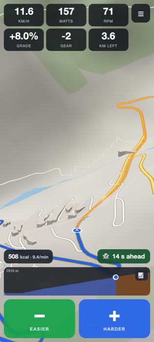
  &nbsp;
  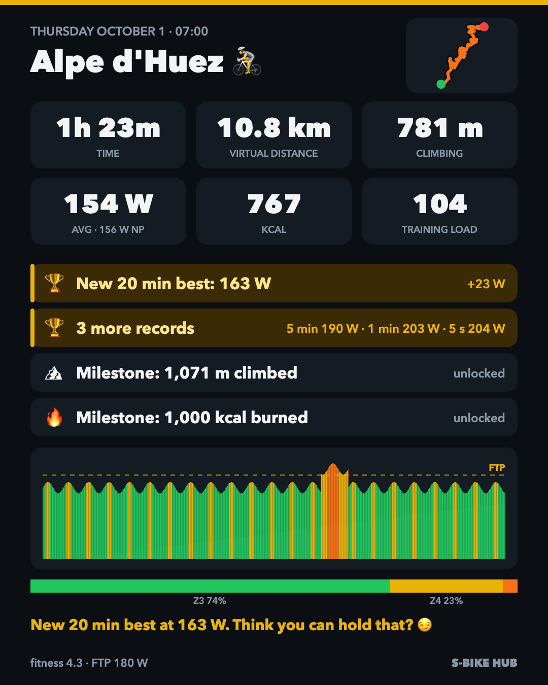
</p>

### Bike bridge features

The tested S29 only accepts **one** Bluetooth connection, and it ignores the "hill" commands that training apps send. The hub sits in the middle: it holds the single connection to the bike, and then:

- **Shares the bike.** It re-advertises the bike as a new device ("SBike Hub"), so a watch (power + cadence) and a training app can connect at the same time.
- **Makes hills real.** Grades from a route or a training app become resistance, eased in smoothly, with **virtual gears** on top.
- **Auto-shifts.** It keeps your cadence in a band (65–80 rpm by default), shifting sooner the harder you spin. With a **daily focus** it also steers your watts into a range: easy but still productive. A **climbing mode** handles low-cadence standing efforts.
- **Computes virtual speed** from watts, weight and grade, so climbs feel like climbs.
- **Runs ERG workouts.** It holds a target wattage whatever your cadence. In a workout it works in zones around each block's target instead of chasing every watt: green normally starts at the segment's target floor (100–120%). Easy workout blocks allow a wider upper band, bounded by the easy-workout ceiling. Power is smoothed over 10 seconds, shifts allow settling time, and sustained drift is checked before changing gear. Below-floor corrections can happen sooner than above-floor corrections. It checks the next gear and prefers the easiest measured setting that still achieves the target. FTP tests and Kinomap keep tight control.
- **Pauses and resumes.** The workout clock only runs while you pedal with the bike connected: stop and it pauses by itself, or tap ⏸. If a workout stops before it's done (you tapped End, the page reloaded, the bridge restarted), the Coach page and the game view offer **Resume** for the rest of the day, at the same block and second. The pieces of a day's ride count as one session.

<p align="center">
  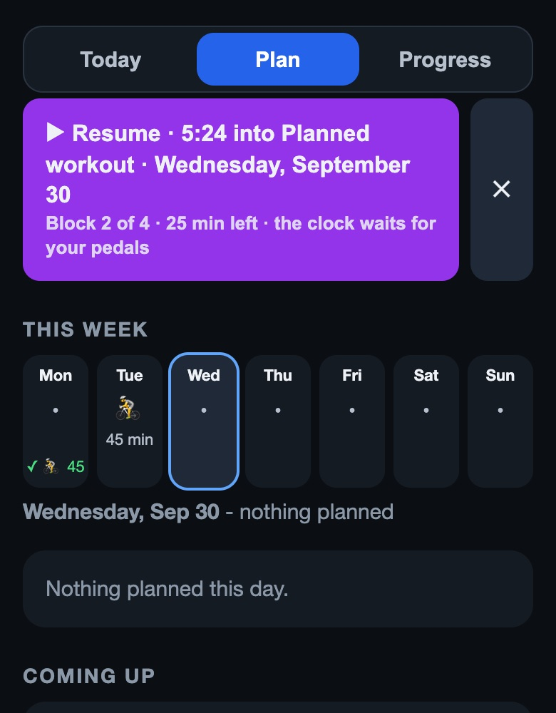
  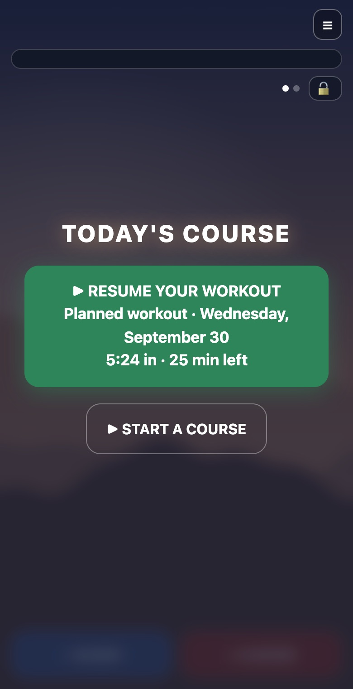
</p>


## More features

| | |
|---|---|
| 🗺 **Offline routes in 3D** | Plan A→B rides, loops, or "N km in any direction" rides on real roads, with a local BRouter route planner. Search towns and mountains offline, or tap famous rides (Alpe d'Huez, Ventoux, Tourmalet, PCH…). Then ride them in a tilted 3D follow view with real terrain and buildings. You can import GPX from Strava, Komoot and others. |
| 📱 **Phone / tablet handlebar remote** | The ride view works on any phone or tablet on your Wi-Fi (on a phone, the numbers and the route take turns at the top, Kinomap-style, so the map gets the screen): giant shift buttons with vibration, a drawer for auto-shift, climbing mode, ERG and workouts. Pair by scanning a QR code on the Mac (a one-time code) or typing a PIN. |
| 👻 **Ghost racing** | Race your last ride on the same route: "14 s ahead". |
| 🎚 **Daily focus** | Each day has a cadence range and a watt range: cadence habit (65–80 rpm, zone 2), grit (big gear, low cadence), leg speed, recovery, or your own. Auto-shift steers toward both, and a quiet monitor on the ride view shows time in range, with a hint only after you've drifted for a while. |
| 📍 **Area routes** | Circle where you'd like to ride and say how long. The planner finds loops inside the circle and ranks them for today's focus: time at the focus's watts (climbs slow you), how much of it auto-shift can hold in range, and whether the terrain suits the day. |
| ⛰ **Climb goals & efforts** | Put training on a route's climbs: "climb 2 in 10:00" becomes a watt target re-worked every second from what's left, and "3 × 15 s at 200 W" shifts you straight into a big gear. Every climb you ride is recorded (time, watts, cadence, VAM), and the planner knows the fastest time your **W′** could cover. |
| 🎮 **Game view** | A ride with no map route becomes a side-scroller whose hills are the workout. Plan a ride (a course sized to the planned minutes) or hit **Ride now** on a workout (terrain drawn from its blocks). Stay inside your cadence and watt ranges to ride the **lit road** and evolve through your chosen animals: bike → unicorn → wolf → eagle → dragon, or any order you pick from 17. Spin and push **gates** ask for the top of your range for 10 seconds. **Modern** (soft layered silhouettes, dawn to dusk) or **8-bit**. Saved map routes open here too, with their real hills, and 🎮 / 🗺 switch views mid-ride. See [The game view](#the-game-view). |
| 🧭 **Coach** | Five tabs: **Today** (the verdict, collapsible check-in journal and daily workouts), **Plan**, **Fitness Dashboard**, **Progress**, and **Rules**. This week at a glance (a marker per day, including swims your watch calendar can't hold), a one-tap effort rating, morning readiness from your watch (HRV, resting heart rate, sleep), **skill ladders** that step up and down with the evidence, **test weeks**, and a calibration card for every capacity. A 6-minute **morning diagnostic** (fixed watts, heart rate read off your watch) gives a go / easy / rest verdict against your own normal. The **timed-workout builder** lets you pick a length, drag bars, and see the parts rebalance in proportion. A short **journal** goes with each check-in. It's never scored, but it raises a **flag** when your words and your sliders disagree (see [The journal flags](#the-journal-flags)). |
| 🫀🦶🦵 **Training load for every sport** | Runs, walks, swims, gym and rides from your watch feed three shared systems: **heart & lungs**, **feet & bones**, and **leg muscles**, plus separate swimming and regional lifting recovery models. The Coach provides sport-specific recommendations and a body map of overlapping sources. Running is tracked as accumulated "blocks" on a conservative, provisional recovery timeline. Tap any system for its graph, readings, and the sessions behind it. See [Training load: how it works](#training-load-how-it-works). |
| 🎯 **Workout adherence** | Each part of a workout is graded A–F on how well you held it, shown as a pie and a radar chart in the ride report. |
| 📈 **Live graph, calories, fitness** | A live power graph in zone colors, calories from real work (kJ), personal bests (5 s / 1 / 5 / 20 min) with callouts, and a power-based fitness / fatigue / form chart. |
| 🏆 **Streaks & milestones** | Day and week streaks, tiered milestones, and fun comparisons (Eiffel Tower, Alpe d'Huez, Everest…). |
| 📣 **Ride posts** | An automatic, friendly-but-competitive infographic and caption for every ride, plus a "Copy for Claude" pack for custom ones. Optional Strava posting of the title and caption. |
| 🛠 **Workout builder** | Steady, ramp and interval blocks in % of FTP, so workouts rescale when your FTP changes. There's also an FTP ramp test. |
| 💪 **Self-healing** | If the bridge crashes mid-ride, the menu-bar icon restarts it and the ride continues in the same file. |

<p align="center">
  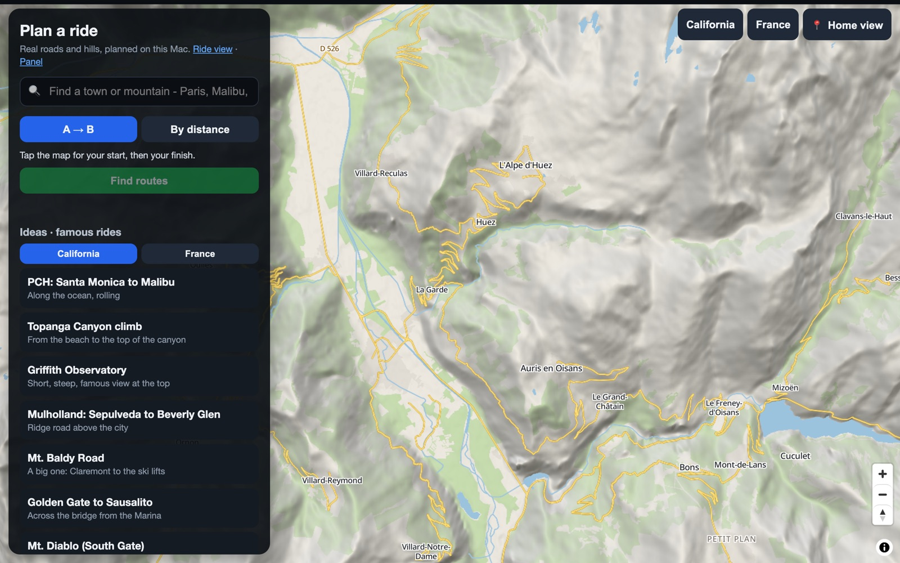
</p>
<p align="center">
  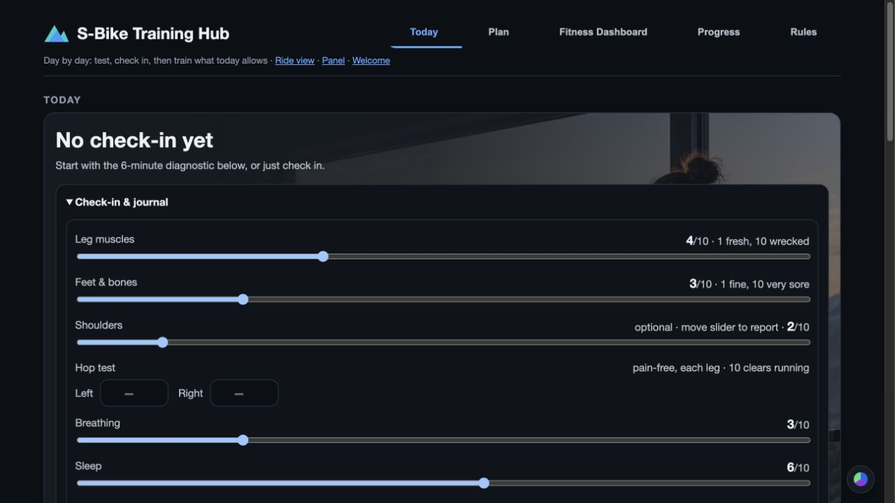
  &nbsp;
  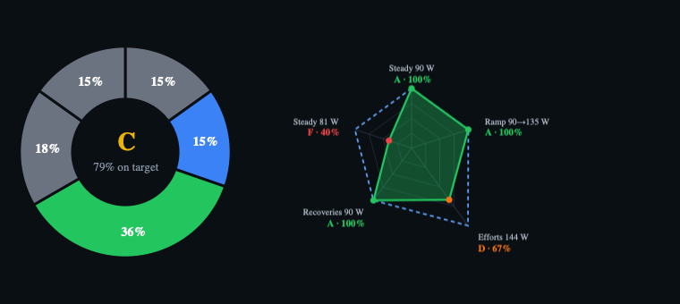
</p>

## What you need

- **A Mac** with Bluetooth, running macOS 13 or newer. The hub uses Apple's Bluetooth and drawing libraries, so it's macOS-only.
- **Python 3.11+** (`brew install python`) and, for the route planner, **Java** (`brew install openjdk`).
- **Optional smart bike** for connected cycling. Tested: Merach S29. Coach, workout planning, importing, and load tracking can run without one.
- **Disk space for maps:** roughly 1–10 GB depending on the regions you choose. The bridge alone needs almost nothing.
- **Optional:** a watch that pairs with Bluetooth power/cadence sensors (tested: COROS Pace 4), and a phone or tablet for the handlebar remote.

## Quick start

```bash
git clone https://github.com/JHarp199345/S-Bike-Training-Hub.git
cd S-Bike-Training-Hub
./setup.sh
```

`setup.sh` does the following:
- creates the Python environment and installs the packages
- downloads the route planner, the map and the 3D terrain for the regions in [`regions.json`](regions.json), asking before each big download
- makes a **"S-Bike Hub" launcher on your Desktop**
- can add the 🚲 **menu-bar icon**

To skip maps and routes and get just the bridge, run `./setup.sh --no-maps`.

**No smart bike?** Run `./setup.sh --no-bike`. You get the Coach, training load for every sport from your watch files, lifting, the dashboard and the AI coaching tools, with no Bluetooth at all. The launcher opens straight to the Coach.

For connected cycling, continue below. In no-bike mode, open the Coach, set your profile, and import your activities.

1. **Wake the bike** (pedal a few turns). Make sure no phone or app is connected to it.
2. **Double-click "S-Bike Hub" on your Desktop**, or use the 🚲 menu icon. The first time, macOS asks to allow **Terminal** to use Bluetooth; say yes. The control panel opens at <http://127.0.0.1:8729>.
3. **Pair your watch** to "SBike Hub" as a power meter and a speed/cadence sensor.
4. **Set yourself up:**
   - open **Welcome → Set yourself up** to enter your sports, body weight, heart-rate values, available time and goals. Enter a known FTP if available; an FTP test is optional and should fit your readiness and training phase.
   - choose a calibration week or supply recent comfortable lifting sets if you want weighted starters. Preview the suggested program and its load flags before applying it. Missing personal values remain assumptions until calibrated.
   - in the planner, move the map to where you ride and press **📍 Home view**.
5. **Put your phone on the handlebars.** Scan the QR code in the panel's *Phone remote* box (same Wi-Fi), and it opens the ride view, paired.

### Choosing map regions

Edit [`regions.json`](regions.json) (name, bounding box, center, zoom) and run `./setup.sh` again. The example regions are California and France, the two it was tested with. Map files are pulled from the latest daily [Protomaps](https://protomaps.com) build in pieces of up to 5×5°, so a dropped connection only costs one piece.

## Pages

| Page | What it's for |
|---|---|
| `/welcome` | What the hub does, what you need, connecting your AI, and a two-minute setup. `/` opens it on a first run, then the Coach. |
| `/panel` | Connections, live numbers, gears, auto-shift, climbing, ERG, workouts, FTP test, personal bests, live graph, phone pairing |
| `/ride` | 3D ride view and handlebar remote (phone / tablet / computer) |
| `/plan` | Route planner: search, A→B, loops, "by distance", **area** (routes for today's focus), a route's climbs with time goals and efforts, famous-ride ideas, GPX import |
| `/coach` | Today, Plan, Fitness Dashboard, Progress, and Rules; sport-specific recommendations, check-ins, calendar, multiple daily sessions, training blocks, projected loads, workout details, swim profiles, lifting, and reviews |
| `/coach#fitness` | Fitness Dashboard: detailed load metrics, body map, sport verdicts, recovery estimates, and calibration evidence |
| `/course` | The game view: today's course, a running workout, or the route you're riding |
| `/workouts` | Block-based workout builder |
| `/fitness` | Legacy cycling detail view; its information is also available in Fitness Dashboard under Cycling history |
| `/milestones` | Streaks, totals, badges |
| `/posts` | Ride infographics, captions, the Claude pack, optional Strava |

## The game view

<p align="center">
  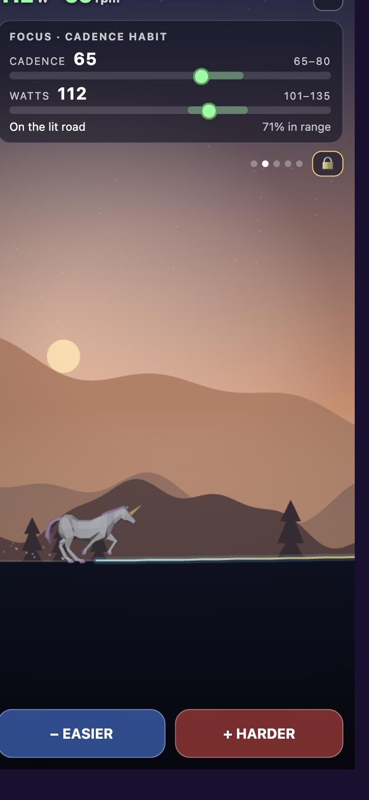
  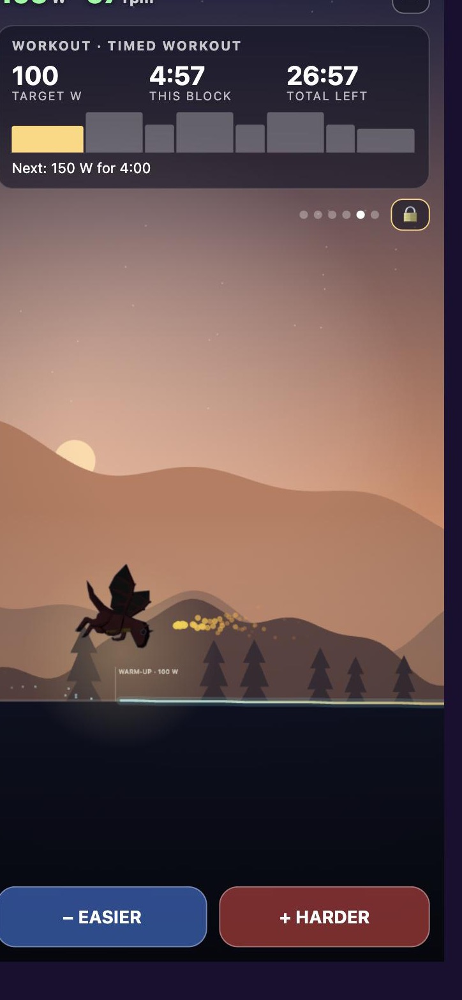
  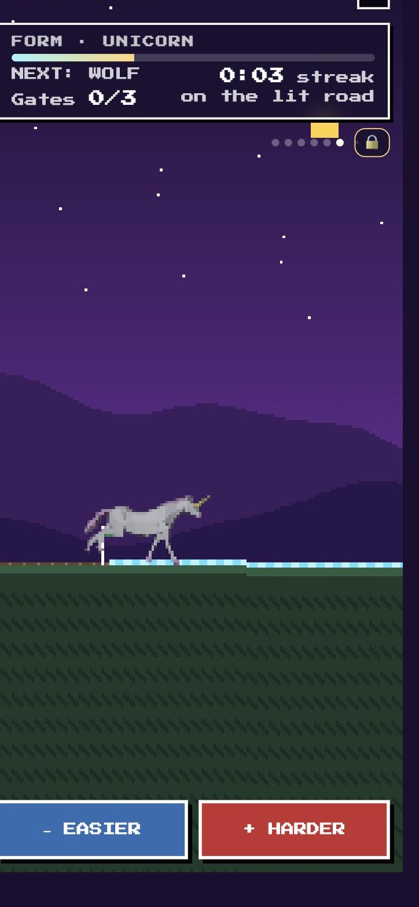
  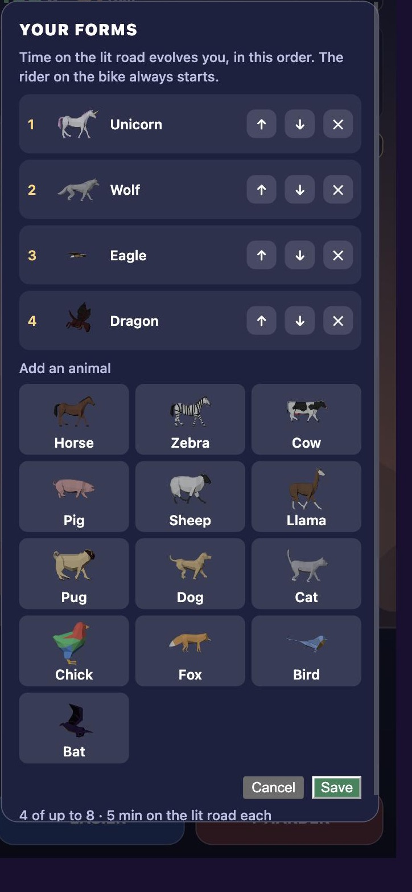
</p>

- **Where the terrain comes from:**
  - **A planned ride with no route:** warm-up, steady climbs with short descents between them, cool-down. It's sized so it takes the planned minutes at your focus's middle watts, and the bridge rides it like any route, so auto-shift and the focus work as usual.
  - **A workout from the builder:** it runs in ERG, and the terrain comes from its blocks (harder blocks are steeper). The picture follows the workout's clock, so the next interval shows as a hill ahead.
  - **A saved map route:** its real elevation profile.
- **The lit road:** inside both your cadence and watt ranges (in a workout, watts near the block's target). Time on it evolves you, **5 minutes per form**; a minute off it drops you one form, not all the way.
- **The animals:** 17 of them, filmed from CC0 3D models by [Quaternius](https://quaternius.com) into sprite strips, in colour. The farm animals walk below about 16 km/h and gallop above about 19, so pace shows as a change of gait. Pick your forms and their order from **☰ → Forms…**; the choice is kept on the bridge.
- **Overlays:** the ride's numbers come one card at a time - Ride, Focus, Graph (the last 10 minutes), Route, Workout, Form - cycling every 8 seconds. Tap or swipe to move on, 🔒 to hold one. Something happening jumps to its card for a few seconds. Watts and cadence stay up top. The map view uses the same overlays on phones.
- **Yellow is on the road too:** green and yellow workout power zones count toward forms and gates when cadence requirements are met. Easy blocks have wider upper power bands; red and black do not count.
- **No map where there's no road:** a watts-and-cadence workout, or a made-up course, only rides in the game view.

## Coaching with an AI assistant (optional)

The MCP server gives an optional AI assistant tools to read training data, inspect templates and calibration, preview programs and write plans. It uses the Hub’s own calculations. Some newer controls still need dedicated MCP tools; see the [MCP capability review](docs/mcp-capability-review.md).

**Desktop MCP bundle:** [Download MCP 1.2.1](https://github.com/JHarp199345/S-Bike-Training-Hub/releases/download/mcp-v1.2.1/s-bike-hub-mcp-1.2.1.mcpb), or read the [release notes](https://github.com/JHarp199345/S-Bike-Training-Hub/releases/tag/mcp-v1.2.1). Install it in your compatible desktop MCP client and replace the older bundle. The updated Hub must be running locally. App updates do not automatically update an installed bundle. Version 1.2 adds program reading, previewing, applying, and progress evidence; see [integration details](docs/mcp-1.2-integration.md).

- **Command line:** `./hub today`, `./hub rides`, `./hub fitness`, `./hub load`, `./hub checkins`, `./hub checkin --feet 4 --legs 5`, `./hub steps 2026-09-27=6200`, `./hub import FILE.fit`, `./hub plan --verdict easy --note "…" --workout ID`, `./hub split --total 30 --intervals 3`. Run `./hub --help` for the rest.
- **MCP server:** [`mcp_server.py`](mcp_server.py) exposes tools (today, check-ins, rides, a ride's full story, fitness, body-system load, importing watch files, daily steps, morning readiness, effort ratings, the day's focus and plan, area routes, climb goals, skill ladders, calibration and tests, test weeks, the aerobic engine, sport carry-over, milestones, workouts…) to compatible MCP clients. For Claude Code:

  ```bash
  claude mcp add --scope user s-bike-hub -- "$PWD/.venv/bin/python" "$PWD/mcp_server.py"
  ```

  For Claude Desktop, use the bundle installation below. Manual configuration is an alternative for developers. The MCP server connects to your local Hub; data returned to an external assistant is subject to that assistant’s provider policies.

### Install the Claude Desktop extension

1. Start the updated Hub using its Desktop launcher. The extension does not install or start the main app for you.
2. Download the **1.2.1 `.mcpb`** above. In Claude Desktop, open **Settings → Extensions → Advanced settings → Install extension**, and select the file.
3. Review the extension’s local-access notice and install it. Under **Configure**, leave the Hub address at `http://127.0.0.1:8729` unless you deliberately changed the port.
4. Confirm **Enabled** is on and the tools are listed. This version exposes **52 tools**, including **Get program**, **Preview program**, **Apply program**, and **Get progress evidence**. Normal tool approval prompts are expected.
5. Ask the assistant to read the current program first, preview proposed changes, explain forecast assumptions and limits, and apply only the changes you approve. It should then read back the saved program.

**Installation verified on macOS in Claude Desktop.** The bundle was discovered without editing configuration files or installing additional Python packages. Its packaged server also passed an isolated read → preview → apply → check-in → progress test on macOS’s stock Python 3.9. The main Hub still requires Python 3.11+ and the normal app setup above. This is a local desktop connection; a remote cloud session cannot reach your Mac’s localhost directly.

Program previews return a compact scenario comparison; the assistant can request **1–7 days** of detailed prescriptions and projected readings at a time. This keeps the working context manageable. Applying currently rebuilds from the reviewed fields rather than locking an exact draft: re-preview after changed inputs or new athlete data. [Verified behavior and remaining work](docs/mcp-capability-review.md).

The Hub now includes persistent **macro programs with editable phases and detailed starter workouts for up to 12 weeks**, multiple daily sessions, sport-specific workout templates, projected loads, and Sunday review recommendations. An AI coach can use these tools to build and revise a plan around your event goals, available time, calculated load, and reports. A block can extend an already scheduled week; it is not an autonomous guarantee of an optimized program. Recheck actual results and readiness as the week unfolds.

The workflow is **plan → train → import/log → report → review and adapt**. Lifting has its own follow-ups, while Sunday reviews consider the training week across sports. If your AI has a separate watch connector (COROS, for example), it can import activities and record daily steps; otherwise, import watch files yourself.

**AI is optional and supplied separately.** The Hub does not include an AI subscription or require a paid API key for its local calculations. A compatible assistant's free tier may be sufficient for routine check-ins and plan reviews, subject to its access and usage limits. We have not verified the complete coaching workflow on every free-tier client. Providing training data to an external AI service is separate from keeping the Hub's files local.

## Training load: how it works

A single training-load total can miss the distinction between cardiovascular effort and local mechanical demands. The Hub separates those demands so an easy cardiovascular session does not automatically imply that every muscle group is ready for more work.

> ⚠️ This is an **experimental planning model**, not a measurement of your body. It has been tuned against one rider's real training and how it felt. The numbers are starting points that adapt to you (see below). It doesn't diagnose anything: if something hurts, stop and see someone.

### Shared body systems and sport-specific recovery

Every imported activity and recorded bridge ride contributes to shared systems where relevant. Swimming also has a stroke-exposure recovery curve, and logged lifting has recovery estimates per region. These are related planning signals with different units, not interchangeable measurements of tissue damage:

| System | What loads it | How it's scored |
|---|---|---|
| ❤️ **Heart & lungs** | everything | Rides with power: training stress from watts (TSS: time × intensity², 100 = an hour at FTP). Other activities: heart-rate load (Banister TRIMP), calibrated using **your own rides that have both watts and heart rate**. Unassisted swims with CSS use pace-based load; fin-assisted swims exclude that pace estimate and use heart rate or an explicitly provisional effort fallback. |
| 🦶 **Feet & bones** | running, walking | Every step's force, raised to the **4th power**. See below. |
| 🦵 **Leg muscles** | bike, running, walking, gym, swim kicking | Bike: pedal torque squared. Running/walking: weight, distance, and speed. Detailed lifting: the leg regions' exercise points; otherwise a generic effort-duration proxy for recorded gym sessions. Swimming: kicking exposure, with equipment and effort context. |

The shared systems track **fitness** (a long average) and **fatigue** (a shorter average). Ratio-based planning bands are:
- under 0.8: room to build
- 0.8–1.3: the model's working band
- 1.3–1.5: caution
- 1.5 or higher: rest in ratio-based rules

These are provisional planning bands using exponentially weighted averages, not universal injury thresholds. Untuned cardiovascular readiness uses fitness–fatigue form instead; running also has its accumulated-block and progression gates. Separate swimming and lifting blocks are not the same units as these ratios.

**Readiness is weakest-link:**
- The **bike** verdict comes from heart & lungs and leg muscles.
- The **running** verdict comes from feet & bones and leg muscles.
- Cycling has no modeled running-impact dose; riding still depends on leg readiness, cardiovascular readiness, and relevant shared-region demands.
- Swimming and lifting also consider their own recovery estimates and overlapping regional exposure.
- Your morning check-in (feet, legs, breathing, 1–10) can always make it more careful: 6+ means easy, 8+ means rest.

#### The journal flags
The journal is your own words, and it never moves a number by itself: letting words score invites drifting into a longer (or shorter) recovery without meaning to. Instead it **flags**:
- **Words vs sliders.** "Sharp pain in my shin" with feet & bones at 3/10, "pulled my hamstring" with legs at 2, or "fever" with breathing at 3. The other way too: "feel great, no pain" with feet at 7.
- **Something serious**, whatever the sliders say: swelling, a limp, can't bear weight, pain at night, chest pain.
- Negations don't count ("no sharp pain", "not swollen").

Each flag waits for you: **It's real - count it** or **It's fine**. Only a confirmed flag counts, the way moving its slider would: bone or muscle read as 6/10 that day (then judged by the phase rules), illness makes heart & lungs easy. An AI coach can settle a flag (`settle_journal_flag`) only on your say-so.

### Feet & bones: steps, force, and blocks

Running is the scarcest resource, and it's the most closely managed.

**1. Every step is a force.**
- Steps come from your watch's cadence.
- Each step's peak force is estimated from your weight and speed: about 1.2 × body weight walking, 2 + 0.2 × speed (m/s) × body weight jogging, more downhill.
- The impact **proxy** rises with the **4th power** of estimated force, inspired by Carter's daily stress stimulus. Applying it here is a modeling choice, not a measurement of tendon, knee, or bone damage.
- A step with 20% greater estimated force contributes about twice the proxy score. Walking contributes less than running under these assumptions; the exact ratio depends on pace and the force estimate.
- The detail view shows each run's steps, average force in pounds, and its damage as **"steps at 1,000 lb"**.

**2. Runs add up in blocks.**
- **One block** is your own unit: the median of your first three runs, with an estimate for an unconditioned body at your weight as the floor.
- A run landing on load that's still there costs extra, up to ×4 on top of a heavy load. So the same run two days in a row costs far more the second time.
- Days already served count. A new run adds 5 days per block it added to whatever plateau is still owed: run (5 days), a day passes (4 left), run again as 2 blocks (+10) = 14 days.

**3. Blocks recover slowly, in three phases.** The timing scales with the load, with no cap:
- a **plateau** of about **5 days per added block**, during which the accumulated score holds steady; this does not mean biological healing stops
- a **decline** over about **3 days per block**, down to a fifth
- a **long tail** parameterized at **120 days**, inspired by remodeling timescales rather than measuring an individual's remodeling

So a load of 2 blocks plateaus about 10 days and declines over about 6. A load of 13 blocks plateaus about 65 days (less the days served between the runs that built it) and declines over about 39, then the tail. Recovery time per block is the same at every level of fitness; conditioning changes how much running a block holds, not how long it takes to clear.

**4. Running decisions respect the blocks and progression checks.**
- At **1.5 blocks or higher**, the training-block gate holds running. From 1.0 blocks, the underlying load model recommends easy work rather than normal work.
- A separate **five-day recent-run response** tracks the short response to a session.
- Recent pain-free hop reports are one input to readiness; a good report does not bypass the mechanical training-block gate.
- The current progression preset also requires repeated comfortable strength, balance, and loading checks, including dated next-day responses, and a minimum wait since the last run. Its default **50 days is the originating athlete's conservative preference**, configurable in `run_progression.minimum_run_days`; it is not a universal recovery period.
- The first **60% of the plateau** is protected. After that, a deliberate review may begin decline early only with repeated successful checks. Carried load is preserved and running remains separately gated. A setback can reverse that tentative calibration.
- Ordinary reports affect today's recommendation immediately; they adjust the accumulated decline only **after the plateau**. Running eligibility opens a plan review, not an automatic run prescription.

The underlying load model retains a tail-phase exception for particularly good feet/leg reports. The training-block gate and progression checks remain stricter: that exception does not override their holds. See [Tentative running progression](#tentative-running-progression).

**5. Walking counts too, but lightly.**
- Your watch's daily steps, minus the steps in your runs, are your walking.
- **Free steps.** No step is free, but your feet repair a daily budget, and walking inside it doesn't pile up. The budget comes from your conditioning, whichever is bigger:
  - **running:** one day's repair (1/8 of your block, to start) in your own walking steps. A bigger block from benchmark runs means more free steps.
  - **walking:** what you've walked and woken up fine from (at least three good mornings in 60 days), scaled to a fresh foot.
  - Biking and swimming earn nothing: they don't load feet and bones.
- **Your mornings correct it.** A rough morning after a day over the line (feet or legs 6/10+, or hops down 2+) lowers the running-side estimate; a good one raises it, more slowly.
- The free steps **shrink as your load rises**: about 60% of fresh at 13 blocks, never below a quarter.
- Only the steps over the line count, and only they carry the "load already there" multiplier, scaled down to match how light a walking step is.
- Walking extends the plateau (5 days per block) instead of restarting it. A few quiet days let it drain; weeks of 10,000+ steps with no rest don't.

The Coach page shows all of it:
- the bike and running verdicts
- a tappable card for each system, with a 28-day graph, the readings, the sessions behind the score, your matching check-ins, and "how this score is computed"
- the blocks graph with its no-new-running projection
- the walking table

### How it was conceived

The model grew through repeated use and iteration, driven by differences between the initial scores and the originating athlete's reported experience:

1. **Load ratio across sports.** A standard acute:chronic ratio per system. The first version flagged a perfectly steady routine as dangerous, because its averages were too slow. It switched to Williams' exponentially weighted version, plus a rule that keeps a system on "easy" for a week after a spike.
2. **Heart rate married to watts.** Runs and swims have no power, so heart-rate load is calibrated against the rider's own rides that have both.
3. **Capacity from how the body responded.** The engine handled a big week like easy work while the feet were clearly overdone. So each system's "usual week" can be tuned to what the body actually showed.
4. **Step-based, superlinear impact.** The rider's own arithmetic set this off: thousands of steps at several times body weight is a lot of force for an unconditioned body. Distance became steps × force⁴.
5. **Tissue clocks.** A damage-and-repair model with separate clocks for soft tissue, tendon and bone. It's kept as the "exploratory tissue detail" on the fitness page.
6. **Blocks.** The rider worked out the plateau / decline / tail shape with ChatGPT, to reflect the athlete's reported experience: running held, easier leg work, and more cardiovascular capacity. Whether the projected recovery tracks later outcomes is still being evaluated.
7. **Walking**, then the uncapped timeline and the tail rule, in the same way.

### How it adapts to you

The Hub combines personal data, fitted estimates, and configurable planning assumptions. Not every constant learns automatically: the running progression preset, recovery timings, and participation coefficients still need deliberate review. With recorded evidence, it can refine:

| What adapts | From |
|---|---|
| **Heart-rate → points conversion** | The median ratio of watts-based load to heart-rate load on your own rides with both. |
| **Your jogging step** | Runs without cadence (older .tcx exports) are scored from the per-step force and cadence of your runs that have it. |
| **The size of a block** | Your first three runs, then **benchmark runs**: 2 miles on the same flat loop at a fixed easy pace. Each is graded once the two mornings after are in, on how it felt (1-10), heart rate against the prediction from your last benchmarks, your check-ins leading up to it, and those mornings. Growth follows diminishing returns (about 10% at your starting block, a sliver near 5×), and results overrule the curve: beat the prediction and it grows more and the curve shifts up; fall short and it grows little. Anything hurt, or a 6/10+ morning after: no growth, repeat it. Shown recovery also earns up to +30%: at least four runs over four or more weeks, each followed by three run-free days and reassuring check-ins. |
| **Running decline and tentative progression** | Ordinary reports do not shorten the plateau; post-plateau reports adjust decline. Explicit early-decline reviews after the protected 60% require repeated comfortable checks and dated follow-ups. Setbacks can restore the unshortened curve. |
| **Swimming recovery block size** | Recorded stroke exposure and next-morning shoulder reports, with Sunday reports contributing to the fit. |
| **Regional lifting recovery** | Logged exercise doses and regional follow-up reports, including weekly reviews. |
| **Each system's usual week** | Tuned from how your body responded: `./hub capacity impact 150 --note "feet sore at this"`, the `set_capacity` MCP tool, or your AI coach. |
| **Fitness** | The long averages rise as you train steadily. |
| **Your normal morning** | The diagnostic verdict compares you with the median of your recent tests. |

Settings in `profile.json`:
- Daily steps are recorded separately. The accumulated walking allowance is derived from running-block capacity and demonstrated walking tolerance, rather than a universal fixed daily allowance.
- `gym_rpe`: effort for gym sessions with none logged, default 5
- `training_phase`: `run_durability`, `aerobic_base` or `bike_performance`, which weights the headline balance grade
- `load_calibration`: tuned usual weeks

### Getting your watch data in

- **Activities:** drop `.fit` or `.tcx` files into `activities/`, or run `./hub import FILE_OR_URL`. Duplicates, like the same ride from the watch and the bridge, are counted once; the copy with power wins.
- **Daily steps:** `./hub steps 2026-09-27=6200`, or the `record_steps` MCP tool.
- **Check-ins:** the Coach page, or `./hub checkin --feet 4 --legs 5 --breathing 3`.

### Readiness from the watch overnight

If an AI coach has your watch connected (COROS, for example), it records each morning with `record_morning`:
- **HRV:** below the watch's own normal range makes heart and lungs **easy**. Two mornings running makes it **rest**.
- **Resting heart rate:** 5+ beats over its two-week median means easy, 8+ means rest.
- **Sleep:** under 5 hours means easy.

A rest morning benches running too.

### Progressions and regressions

Each skill is a ladder of concrete steps, after Michael Boyle's approach:

| Skill | Ladder |
|---|---|
| Cadence habit | 65–80 → 70–85 → … → 85–100 rpm |
| Leg speed | faster ranges |
| Grit | longer, harder big-gear sets |
| Climb pace | goals from 110% down to 94% of your best time |
| Running return | walking only → 1:2 jog/walk → … → 30 minutes |

- **Up:** two good sessions on a step earn the next one. Evidence only counts from when you reached the step.
- **Down:** two poor sessions, or a very hard effort rating on grit, drop you one.
- **For the day:** when you're not recovered, you ride one step down without losing your place.
- **Running** drops to walking while it's on rest.

The day's focus and the planner's climb goals use your current steps.

### Calibration and test weeks

Every capacity (FTP, heart rate at 90 W, a big-gear 3-minute test, critical swim speed, the running block, CP and W′) is an estimate combining three things: the latest test, training evidence since then, and anything you set by hand. Each one shows a **confidence** that fades until the next test comes due.

**Tests are plan items, not buttons.** They run from the Coach page's "Ride it" row or the Tests group in the ride menu.

**A test week doubles as a recovery week,** every 6 weeks:

| Day | Session |
|---|---|
| Mon–Wed | easy, reduced sessions |
| Thu | swim CSS test |
| Fri | the 6-minute morning diagnostic, then rest |
| Sat | **test day:** FTP ramp test, or the big-gear test (never two leg tests on one day) |
| Sun | off |

You test at your peak, then start the next block fresh.

**What the results feed:**
- **Unassisted swims** with CSS use pace-based cardio load (hours × (CSS ÷ pace)³ × 100). Fin-assisted swims use heart rate or a provisional effort fallback; shoulder exposure and leg kicking remain separate.
- **The running block** grows by up to 10% after a benchmark run followed by two good mornings.

### Power: CP, W′ and the aerobic engine

**Critical power and W′:**
- **The fit:** CP and W′ come from your best efforts over 3–20 minutes (the 2-parameter model).
- **When it's trusted:** easy rides produce a tidy curve that sits well below your limits, so the fit is only used once CP reaches 85% of FTP. Until then the hub shows it as a floor and uses FTP with a typical W′.
- **Live W′ balance** (the differential model) appears on the ride view once you dip into it, and counts "matches".
- **Doability checks:** climb goals and efforts are checked against W′ before you ride them.

**The aerobic engine,** from your watch's ride files (the watch records power and heart rate together):
- **Watts per beat** (normalized power ÷ heart rate) rises as you get fitter.
- **Heart rate at a fixed 100–120 W** falls.
- **Aerobic decoupling:** watts per beat in the first half vs. the second. Under 5% means the ride stayed aerobic. It's only judged on steady rides of 40+ minutes.

### What the watch saw

<p align="center">
  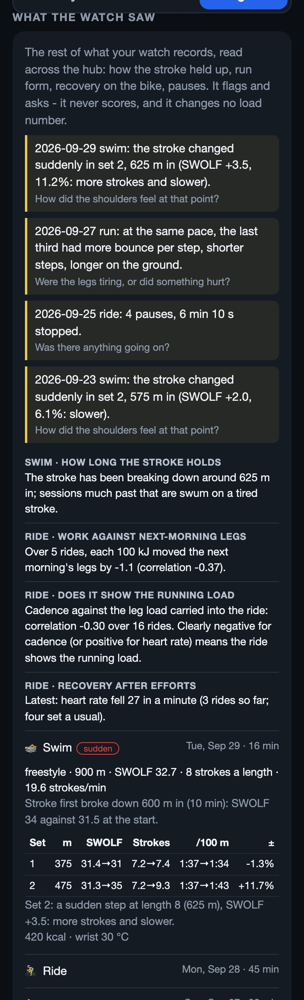
</p>

Beyond the loads, the hub reads the rest of each watch file and cross-references it (**Coach → Progress → What the watch saw**, and `get_insights` for Claude). It flags with the numbers behind it and a question. It never scores, and it changes no load number.
- **Swim, length by length:** SWOLF (seconds + strokes), stroke rate and pace, set by set. Where the stroke changes, by how much and how fast: **held**, **gradual** (a slow fade: ordinary fatigue) or **sudden** (a step between neighbouring lengths; even a small one is the more telling strain signal), and what moved (more strokes, or slower). A set's first length, off the wall on fresh arms, is left out. Across swims it shows how far in the stroke usually breaks down, which is the session length it can hold. Heart-rate drop in the rests is shown, but a wrist in water reads roughly.
- **Run:** laps and 5-minute splits of power, cadence, heart rate, pace, vertical oscillation and ratio, step length, and ground contact per lap. Form drift in the last third is judged only when the pace matched.
- **Ride:** work in kJ against the next morning's legs; heart rate in the opening minutes against your usual at those watts; how far heart rate falls in the minute after a hard effort; whether cadence and heart rate show the running load your legs carried in; heart rate on each climb against the last time up it.
- **Pauses:** stops mid-workout in every sport, counted and timed. A lot of them asks what was going on.
- **Attempts don't count:** a session under 10 minutes, or under half its planned time, isn't marked done or offered for rating.

The thresholds (a 2-point SWOLF step, a 5% fade) are starting points to check against how the sessions felt.

### Swim recovery

For unassisted lengths, a separate swim recovery estimate reads active pool lengths from the watch: `strokes × stroke factor × (length speed / 0.9 m/s)²`, adjusted for paddles, pull buoy and perceived effort. On fin-assisted lengths, arm exposure omits the speed-squared multiplier, while kicking contributes separately to leg-muscle load. Snorkel use is recorded without a force multiplier. The stroke factors and equipment multipliers are provisional tuning choices, not measured tendon forces. One provisional block starts at three times the median dose of the first three swims, then is **fitted continuously** to next-morning shoulder reports: a Bayesian fit over candidate block sizes, with the first-swims value as a log-normal prior, with an 80% interval that narrows as reports come in. The 1.5-block line is a planning convention, not an injury threshold. The Coach's body map (anatomy from [body-highlighter](https://www.npmjs.com/package/body-highlighter), MIT) shows where each sport's load lands; the colours are relative participation, not measured forces.

### Reusable swim profiles

Rules → Swim settings contains eight reusable profiles: **Balanced aerobic**, **Event technique**, **Event endurance**, **Race pace**, **Speed and skills**, **Other-stroke maintenance**, **Kick emphasis**, and **Easy recovery**. Automatic selection considers the nearest swim/triathlon event phase (or the overall goal when none exists), swimming readiness, recent completed swims, tagged sessions over the previous three days, and the latest Sunday swim-progress report within ten days. A stored preference is used only when eligible; blocked preferences fall back with an explanation. A rest verdict blocks all profiles. Heavy swimming allows only easy profiles; kick emphasis is unavailable when leg muscle readiness is easy/rest, or the leg muscle or accumulated running utilization ratio reaches 1.

These are **provisional coaching defaults**. The exact stroke percentages, main-set work ratios, volume multipliers, three-day ordering window, and a 60-point cardio-load flag for a demanding recorded swim are planning heuristics, not validated physiological cutoffs. Each profile supplies a purpose, phases, intensity tier, compatible templates, stroke mix, main-set work shares, and equipment guidance. Main-set metres are allocated in 25 m increments across drill/swim pairs, kicking, pulling, and full-stroke work, retaining the template's efforts and rests. Shares describe distance, not force or muscle activation.

`get_programming(sport="swim", swim_profile="event-technique", date="YYYY-MM-DD")` previews a module without changing preferences. `set_swim_settings(profile_id="auto")` stores automatic selection (or use any profile id). `/api/coach/programming?sport=swim` returns the catalog, eligibility reasons, selected profile, weekly sequence, and generated sets.

### Saved swim rationale and future outlook

Generated swim templates include a `swim_plan` snapshot with achieved stroke/work ratios, purpose, and a selection rationale. Pass this together with `swim_profile` when saving a session; the app's new-session picker does so. The calendar and selected swim show this saved information beside the sets.

Future swim forecasts start from the fitted swim recovery model's recent and repeated exposure components. Estimated session dose uses the median exposure per minute from up to ten past recorded swims; when saved ratios exist, it is adjusted by the planned arm-stroke and drill/swim mix relative to observed stroke factors. Recovery decays using 1.5-day/14-day rates between dates, with an overlap multiplier on each new session.

### Training blocks and mechanical gates

A persistent 4-to-6 week coaching block (`get_training_block` MCP tool, `/api/coach/block`) tracks planned versus completed minutes, cross-sport demanding sessions, and Sunday review recommendations (`advance`, `repeat`, `hold`, `reduce`).

Running has a dedicated gate in the block forecast: its accumulated mechanical score and 1.5-block line, plus the latest reported lower-leg response. A gate on hold prevents the block creator from repeating a week with runs and prevents a Sunday review from advancing running. The mechanical dose itself sets the accumulated curve's plateau. Feet, leg, and hop reports during that plateau affect the day-to-day run/rest decision **without moving the accumulated curve**. Only reports after the plateau adjust its decline duration.

### Ride display

Both ride views provide a full-screen button and request a screen wake lock where the browser supports it. Device/browser support varies; the page must remain visible for the wake lock.

### Adaptive ERG workouts

Workouts in ERG mode support adaptive target scaling and clear safety boundaries. A warm-up or ramp automatically sets a cadence band (55–110 rpm on ramps; 70–90 rpm during adaptive intervals), and a 20-second rolling median power anchor adjusts subsequent interval watts and recovery blocks proportionally, keeping planned easy programs within their 75% FTP ceiling. If the rider pauses or stops pedalling, the workout clock automatically pauses and preserves active pedalling time on crash recovery.

### Lifting and functional strength

A gym session is a list of exercises: barbell lifts, medicine-ball throws, cable and band moves, holds and hangs. List them yourself on the Plan tab (name, sets × reps or time, weight, tempo), or ask your AI to build the session. The AI scores it: the kind of exercise, whether it's **restorative** or **build** work, and how each movement's strain is shared across the body.
- **The check-off** after the workout runs down the list. More weight than planned counts as more load. Less weight asks why: *too heavy* keeps the planned load and lowers the strength estimate; *chose to* counts what you lifted.
- **Each muscle group gets a recovery block**, tuned by a follow-up due three days later and open for two more days. Leg work shares the leg budget with running and riding.
- **The Rules tab** holds your line items: "No barbell squats" is enforced, favourites come up often, anything else guides the AI.
- **The steer** suggests how much of a session should be restorative: 5-10% when you're fresh, about 80% when any system is at its limit. Your after-session and follow-up reports move the curve, and your own call always wins.

- **Calibration on a schedule:** a follow-up three days after every lift session, and a **Sunday check-in** (open through Tuesday) that asks about what your week held: legs if you rode, feet and optional comfortable hop reports if you ran, shoulders if you swam, each muscle group you lifted, and the week overall. A future running event also prompts lower-leg reports while running is paused. The running, swim and lifting models learn from it and trust it most.
- **Lifting carries over:** a muscle group's lifting load counts toward the mechanical load, and toward each sport's verdict by how much that muscle works in the sport. A heavy shoulder day makes the swim verdict easy; kneeling core work barely touches running.

How to use it with an AI coach, and the thinking behind it: **[the wiki](https://github.com/JHarp199345/S-Bike-Training-Hub/wiki/Training-with-your-AI)**.

### The dashboard

<p align="center">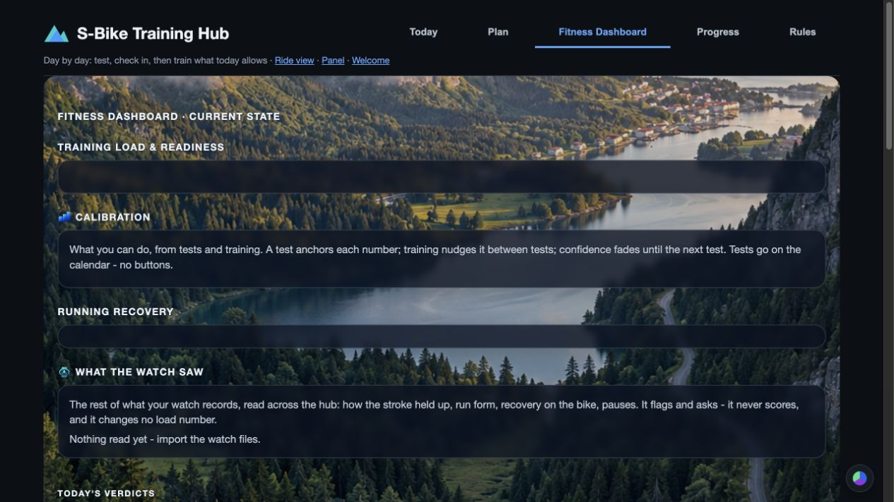</p>

**Fitness Dashboard in Coach** shows everything the hub computes in one place, each chart with a plain "what it means": today's verdict per sport; every piece of the mechanical load as a ring against its limit; cardio fitness, fatigue and form, and where the week's load came from; where the load lands on the body; lifting blocks, the steer's suggestions against what you did, and strength estimates; what the watch saw; and what every model has learned from your tests and reports. Today, Plan and Progress stay simple; the dashboard is where the detail lives.

### How the sports carry over

A carry-over table estimates how much training one sport builds another, compared with training that sport itself, plus how much each sport tires your legs compared with running.
- **Starting values** come from the research: cycling carries over to running (Millet et al. 2002); little carries into swimming; running carries to cycling better than the reverse (Tanaka 1994); and replacing some running with cycling at about 2:1 kept runners' fitness in a 2026 meta-analysis. **Only running builds feet and bones:** cyclists and swimmers carry little bone-loading benefit.
- **It learns your numbers** from every efficiency measurement and next-morning check-in. It uses Bayesian linear regression, which reaches the same answer a Kalman filter would one measurement at a time (after Kolossa 2017 and Swartz et al.).
- **Each value** shows an 80% range and whether it's still the research's number, learning, or learned.
- **Fitness carry-over is slow to pin down.** Weeks where the mix changes, plus test weeks, are what sharpen it.

## Your data stays on your Mac

Everything lives in the project folder and is git-ignored: rides (`rides/`), watch activities and daily steps (`activities/`), saved routes, your profile, FTP and load tuning, personal bests, check-ins, the phone-pairing PIN and tokens, and optional Strava keys. The Hub does not automatically upload your training records to a cloud account. Optional Strava posting and any data you share with an external AI assistant or connector leave the Mac under those services' own policies. Map setup downloads external map data; the phone remote serves authorized devices on your local network.

**The phone remote is plain HTTP on your home Wi-Fi.** It's protected by a PIN or one-time QR code, a long random token per paired device, and rate-limiting. It's meant for a home network, not the internet. Stopping the bridge is Mac-only.

## Other bikes

The hub talks standard **FTMS** (Fitness Machine Service) over Bluetooth, but the S29 has quirks it works around:
- **Resistance:** the S29 has 16 resistance levels that accept "target resistance" commands. It acknowledges "simulation" (hill) commands but ignores them.
- **Commands that reboot it:** "resistance 0" and an FTMS reset, so the bridge never forwards unchecked commands.

To try another bike:
1. Run `.venv/bin/python scan.py` with the bike awake, to see what it advertises.
2. Start the bridge with `--name <start of its Bluetooth name>`.
3. If resistance doesn't respond, the places to adapt are `set_level` and the command filter in `bridge.py`.

Reports and pull requests for other bikes are very welcome.

## Development

```bash
tests/run_all.sh        # Runs every tests/test_*.py file; reports failures by exit status
```

- `bridge.py` is the Bluetooth bridge, gears, ERG and the ride loop.
- `panel.py` and `mapserver.py` serve the web pages and the JSON API.
- `web/` holds the pages.
- Routes and maps: `routes.py`, `planner.py` (BRouter), `pmtiles_reader.py`, `places.py`.
- Training: `coach.py`, `workouts.py`, `programming.py` (sport templates and swim profiles), `training_block.py` (blocks and forecasts), `weekly.py` (Sunday reviews), `bests.py`, `fitness.py`, `milestones.py`, `adherence.py`.
- Training load: `fit.py` (FIT reader), `loads.py` (shared systems and readiness), `damage.py` (running blocks, walking, exploratory tissue detail), `swimload.py` (stroke and equipment exposure), `lifting.py` (exercise doses and regional recovery), `bodymap.py` (shared sources), `recovery.py` (progression checks and saved forecasts), `morning.py` (overnight readiness).
- Coaching: `focus.py` (the day's ranges), `session.py` (climb goals, efforts, climb records), `areaplan.py` (area routes), `skills.py` (progressions and regressions), `calibration.py` (capacities, tests, test weeks), `cp.py` (CP, W′, W′ balance), `aerobic.py` (watts per beat, decoupling), `transfer.py` (cross-sport carry-over, Bayesian).
- Posts: `story.py`, `card.py`, `posts.py`, and `strava.py` (optional).

## ⚠️ Safety

This software changes the resistance on real exercise equipment and relies on reverse-engineered, bike-specific behavior. Use it at your own risk, and keep a way to stop pedaling safely. It's not medical advice. Check with a doctor before starting a training program, and stop if something hurts.

## Credits

- **Map data:** © [OpenStreetMap](https://www.openstreetmap.org/copyright) contributors (ODbL), via [Protomaps](https://protomaps.com).
- **Terrain:** [Mapzen terrain tiles](https://github.com/tilezen/joerd/blob/master/docs/attribution.md) (AWS Open Data).
- **Body map:** [body-highlighter](https://www.npmjs.com/package/body-highlighter) (MIT) - see [web/vendor/body-highlighter.LICENSE](web/vendor/body-highlighter.LICENSE).
- **Game art:** animals rendered from 3D models by [Quaternius](https://quaternius.com) (CC0) - see [web/sprites/CREDITS.md](web/sprites/CREDITS.md).
- **Software:** routing by [BRouter](https://github.com/abrensch/brouter); maps drawn with [MapLibre GL JS](https://maplibre.org); Bluetooth via [bleak](https://github.com/hbldh/bleak) and [bless](https://github.com/kevincar/bless); menu bar via [rumps](https://github.com/jaredks/rumps) and [PyObjC](https://pyobjc.readthedocs.io).

- **Science:** the models build on published work - Banister's fitness-fatigue model, Coggan's TSS/NP, Carter's daily stress stimulus, Williams' EWMA workload ratio, Skiba's W′ balance, Foster's session RPE, Millet et al. (2002) and Tanaka (1994) on cross-training, Boyle's progressions and regressions, and Kalman/Bayesian impulse-response fitting (Kolossa 2017; Swartz et al.). Formulas were cross-checked against [GoldenCheetah](https://github.com/GoldenCheetah/GoldenCheetah)'s open-source metrics; no code was copied.

Built by JHarp199345 with [Claude](https://claude.com) as co-author. The running-load block model was worked out by JHarp199345 with ChatGPT, then built into the hub with Claude.

## License

[MIT](LICENSE).


## Latest coaching and recovery updates

### Shared muscles, specific doses, and prospective forecasts

The Coach calendar groups projected metrics into four-card graph pages. Blue is cardio,
purple muscle/strength, teal swimming, orange running. Recorded model history is solid;
future projections are dashed. Units and scales remain separate. Missing doses propagate
as unavailable rather than fabricated zeros.

* Saved cycling power steps use the existing torque-squared leg formula as well as power TSS.
  Save `cadence: [70,90]` on a session, or an `rpm` on each power step. Without it, the
  forecast explicitly assumes 80 rpm; this is not observed cadence. `bike_plan.power_steps`
  supports duration plus watts or percent FTP and optional rpm. Structured template stages
  use stated range midpoints and disclose compressed interval uncertainty. A focus-only ride
  uses its range midpoint. Legacy duration-only rides still use the recent sport median.
* Scored planned lifts use their actual sets, repetitions, hold duration, weight, tempo,
  and regional shares. Only leg-region points enter the leg system. An unspecified gym
  session no longer inherits a generic gym leg rate: score its exercises to restore forecasts.
* The heat map preserves its strongest-source shading but exposes all activity contributions,
  shared sources and an overlap indicator. Participation weights and the indicator are
  provisional scheduling aids, not measured force percentages or an additive damage score.
  Shared relevant-region exposure can steer work toward easy/restorative recommendations;
  it does not alter the underlying running, swimming or lifting dose multipliers.
* Pre-workout forecast revisions are saved in `coach.json` under `load_forecasts` when Coach
  reads the plan, when plans are updated, and before timed bike workouts start. The first
  baseline is retained; recent distinct revisions are retained up to twelve per day.
  Days with recorded work do not acquire retrospective pre-workout baselines. Actual-versus-
  planned comparisons use the last saved prospective revision and recorded model values;
  missing historical regional metrics remain unavailable and today is labelled in progress.
  Saving a baseline does not claim that its workout was completed.

`POST /api/coach/forecast/save` explicitly freezes available forecasts. `hub forecast-save`
exposes the same action to the assisted journaling workflow.

### Tentative running progression

`recovery.py` includes the originating athlete's conservative example policy; it is not medical
clearance or a research-validated waiting period. The first 60% of the accumulated plateau
is protected. Passing a test never changes the curve automatically. After 60%, an explicit
review may begin decline only after comfortable strength and balance checks on at least two
distinct recent days, with zero reported symptoms, controlled movement, no gritting through,
and comfortable afterward and dated next-day responses. A future or same-day "next-day"
response is rejected. The transition preserves all carried blocks and leaves running locked.

A reported setback after tentative early decline restores the unshortened plateau/curve
where relevant. This is a reversal of calibration, recorded separately from the workout dose;
it is not invented extra force. Ordinary check-ins retain their existing rule: they inform
recommendations immediately, and adjust the accumulated decline only after the plateau.
Walking allowances, running overlap, conditioning credits, and the long tail are preserved.

Running additionally requires load below 1.5 blocks, the personal minimum of 50 days since
the most recent run, and repeated successful strength, balance and loading checks after the
latest setback. Eligibility opens a plan review; it does not automatically schedule a run.
A good hop/feeling report cannot bypass the mechanical lock. Preparatory exercises are logged
as workouts as well as checks; a hold or Nordic exercise is not automatically gentle or healing.

The **Running progression** dialog beside This Week records and updates checks, dated follow-ups,
and explicit early-decline reviews. `GET/POST /api/coach/run-progression`, `hub run-progress`,
`hub run-check --help`, and `hub run-review --begin-decline --note ...` expose the same workflow.
The existing swim stroke-exposure model and its separate recovery curve are preserved.

Research guiding the architecture (not validating the numerical constants):
[Recovery consensus](https://pubmed.ncbi.nlm.nih.gov/29345524/),
[subjective monitoring review](https://pmc.ncbi.nlm.nih.gov/articles/PMC4789708/),
[non-local fatigue review](https://pubmed.ncbi.nlm.nih.gov/33818751/),
[swim volume and shoulder pain review](https://pubmed.ncbi.nlm.nih.gov/31935141/),
[return-to-sport consensus](https://pubmed.ncbi.nlm.nih.gov/27226389/).

### Fins and snorkels in recorded swims

`POST /api/load/swim-activity` accepts `fins`, `snorkel`, equipment fractions (0–1;
whole session when omitted), `fin_type`, optional `kick_rpe`, and `fin_kick_factor`.
The equipment context is preserved in activity exposure and kick-dose details.
For any fin-assisted session, cardio uses the existing calibrated HR/TRIMP model
when at least half the session has plausible observed HR time. Pace vs unassisted
CSS is excluded. With insufficient HR, reported effort supplies an explicitly
provisional hours × (RPE/7)^2 × 100 fallback; no report means incomplete HR with a
low-confidence label. HR calibration is still based on cycling, not a measured
swimming threshold; these remain estimates.

On the fin-assisted fraction, shoulder exposure uses arm stroke count and stroke
style without a speed-squared multiplier, because propulsion from fins cannot be
attributed to shoulder force. This is a relative exposure proxy with lower certainty,
not a measured reduction in tendon load. Unassisted calculations are preserved.
The separate swim recovery curve continues to use this arm-exposure estimate.

Fin kicking adds to the shared leg-muscle system (never running impact): active
watch-length minutes × 0.05 × clamp(kick RPE or swim RPE / 5, 0.5, 2) × fin factor,
weighted by the fin-assisted fraction. Zero-stroke active kick drills are included;
rests are excluded when length timing exists. The unassisted fraction retains its
previous session-minutes × 0.05 dose. The default **1.25 fin factor is a conservative
planning assumption**, adjustable between 1 and 2, not a published coefficient for
Arena fins. Snorkel use is recorded without an unsupported force multiplier.
Swimming leg exposure appears as `swim_kick` on the regional map, separately from
arm-based swimming exposure; qualitative regional coefficients remain provisional.
Check-ins may later justify deliberate calibration, but do not automatically change
the fin factor or shorten the protected running plateau.

Research motivating equipment separation (not the numerical planning factor):
[front-crawl fins/paddles experiment](https://doi.org/10.3389/fphys.2023.1174090),
[fin swimming economy](https://pubmed.ncbi.nlm.nih.gov/12151372/).


### Coordinated Coach icons

The calendar and Coach panels now share colorful sport and feature icons: stationary
cycling, swimming, running, strength, rest, completion, tests, cardio, mechanical
load, projections, conditioning, goals and weekly adaptation. Icons keep their text
labels; decorative artwork does not replace accessible names.
See [the icon map and design prompt](docs/icon-design.md).

The running progression preset retains a 50-day personal minimum wait and a
60% protected plateau. These are the original athlete's conservative preferences,
not universal recovery requirements. The minimum is read from
`run_progression.minimum_run_days` in the local `coach.json`; the model and
preparatory checks remain separate gates.
