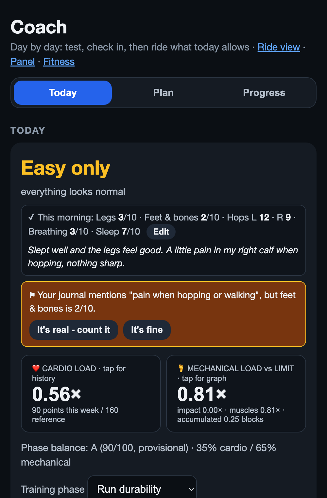

# S-Bike Training Hub

**Turn a budget smart bike into a full training setup: offline 3D routes, virtual hills and gears, auto-shifting, ERG workouts, a phone handlebar remote, and a training-load model that covers every sport you do, not just the bike. It runs entirely on your Mac, with no subscription and no cloud.**

It was built for, and has only been tested on, the **Merach S29**. Other smart bikes that speak Bluetooth FTMS may work, but we couldn't test them (see [Other bikes](#other-bikes)).

<p align="center">
  
  &nbsp;
  
</p>

## What it does

The S29 only accepts **one** Bluetooth connection, and it ignores the "hill" commands that training apps send. The hub sits in the middle: it holds the single connection to the bike, and then:

- **Shares the bike.** It re-advertises the bike as a new device ("SBike Hub"), so a watch (power + cadence) and a training app can connect at the same time.
- **Makes hills real.** Grades from a route or a training app become resistance, eased in smoothly, with **virtual gears** on top.
- **Auto-shifts.** It keeps your cadence in a band (65–80 rpm by default), shifting sooner the harder you spin. A **climbing mode** handles low-cadence standing efforts.
- **Computes virtual speed** from watts, weight and grade, so climbs feel like climbs.
- **Runs ERG workouts.** It holds a target wattage whatever your cadence.

On top of that:

| | |
|---|---|
| 🗺 **Offline routes in 3D** | Plan A→B rides, loops, or "N km in any direction" rides on real roads, with a local BRouter route planner. Search towns and mountains offline, or tap famous rides (Alpe d'Huez, Ventoux, Tourmalet, PCH…). Then ride them in a tilted 3D follow view with real terrain and buildings. You can import GPX from Strava, Komoot and others. |
| 📱 **Phone / tablet handlebar remote** | The ride view works on any phone or tablet on your Wi-Fi: giant shift buttons with vibration, a drawer for auto-shift, climbing mode, ERG and workouts. Pair by scanning a QR code on the Mac (a one-time code) or typing a PIN. |
| 👻 **Ghost racing** | Race your last ride on the same route: "14 s ahead". |
| 🧭 **Coach** | A 6-minute **morning diagnostic** (fixed watts, heart rate read off your watch) gives a go / easy / rest verdict against your own normal. The **timed-workout builder** lets you pick a length, drag bars, and see the parts rebalance in proportion. |
| 🫀🦶🦵 **Training load for every sport** | Runs, walks, swims, gym and rides from your watch, scored on three body systems: **heart & lungs**, **feet & bones**, **leg muscles**. You get separate **bike** and **running** verdicts, and the running load is tracked as accumulated "blocks" that recover on a realistic, slow timeline. Tap any system for its graph, readings, and the sessions behind it. See [Training load: how it works](#training-load-how-it-works). |
| 🎯 **Workout adherence** | Each part of a workout is graded A–F on how well you held it, shown as a pie and a radar chart in the ride report. |
| 📈 **Live graph, calories, fitness** | A live power graph in zone colors, calories from real work (kJ), personal bests (5 s / 1 / 5 / 20 min) with callouts, and a power-based fitness / fatigue / form chart. |
| 🏆 **Streaks & milestones** | Day and week streaks, tiered milestones, and fun comparisons (Eiffel Tower, Alpe d'Huez, Everest…). |
| 📣 **Ride posts** | An automatic, friendly-but-competitive infographic and caption for every ride, plus a "Copy for Claude" pack for custom ones. Optional Strava posting of the title and caption. |
| 🛠 **Workout builder** | Steady, ramp and interval blocks in % of FTP, so workouts rescale when your FTP changes. There's also an FTP ramp test. |
| 💪 **Self-healing** | If the bridge crashes mid-ride, the menu-bar icon restarts it and the ride continues in the same file. |

<p align="center">
  
</p>
<p align="center">
  
  &nbsp;
  
</p>

## What you need

- **A Mac** with Bluetooth, running macOS 13 or newer. The hub uses Apple's Bluetooth and drawing libraries, so it's macOS-only.
- **Python 3.11+** (`brew install python`) and, for the route planner, **Java** (`brew install openjdk`).
- **A smart bike.** Tested: Merach S29.
- **Disk space for maps:** roughly 1–10 GB depending on the regions you choose. The bridge alone needs almost nothing.
- **Optional:** a watch that pairs with Bluetooth power/cadence sensors (tested: COROS Pace 4), and a phone or tablet for the handlebar remote.

## Quick start

```bash
git clone https://github.com/JHarp199345/S-Bike-Training-Hub.git
cd S-Bike-Training-Hub
./setup.sh
```

`setup.sh` does the following:
- creates the Python environment and installs the packages
- downloads the route planner, the map and the 3D terrain for the regions in [`regions.json`](regions.json), asking before each big download
- makes a **"S-Bike Hub" launcher on your Desktop**
- can add the 🚲 **menu-bar icon**

To skip maps and routes and get just the bridge, run `./setup.sh --no-maps`.

Then:

1. **Wake the bike** (pedal a few turns). Make sure no phone or app is connected to it.
2. **Double-click "S-Bike Hub" on your Desktop**, or use the 🚲 menu icon. The first time, macOS asks to allow **Terminal** to use Bluetooth; say yes. The control panel opens at <http://127.0.0.1:8729>.
3. **Pair your watch** to "SBike Hub" as a power meter and a speed/cadence sensor.
4. **Set yourself up:**
   - run the **FTP ramp test** from the panel. The starting FTP is only a guess, and zones, workouts and fitness all scale from it.
   - set yourself up in `profile.json` in the project folder: `{"weight_kg": 80, "hr_rest": 60, "hr_max": 185}`. Weight drives virtual speed and running impact; the heart rates drive the heart-rate load. Your FTP gets saved in the same file.
   - in the planner, move the map to where you ride and press **📍 Home view**.
5. **Put your phone on the handlebars.** Scan the QR code in the panel's *Phone remote* box (same Wi-Fi), and it opens the ride view, paired.

### Choosing map regions

Edit [`regions.json`](regions.json) (name, bounding box, center, zoom) and run `./setup.sh` again. The example regions are California and France, the two it was tested with. Map files are pulled from the latest daily [Protomaps](https://protomaps.com) build in pieces of up to 5×5°, so a dropped connection only costs one piece.

## Pages

| Page | What it's for |
|---|---|
| `/` panel | Connections, live numbers, gears, auto-shift, climbing, ERG, workouts, FTP test, personal bests, live graph, phone pairing |
| `/ride` | 3D ride view and handlebar remote (phone / tablet / computer) |
| `/plan` | Route planner: search, A→B, loops, "by distance", famous-ride ideas, GPX import |
| `/coach` | Morning diagnostic, check-ins, today's bike and running verdicts, the body systems (tap for detail), timed-workout builder |
| `/workouts` | Block-based workout builder |
| `/fitness` | Fitness, fatigue and form from power; body systems across every sport |
| `/milestones` | Streaks, totals, badges |
| `/posts` | Ride infographics, captions, the Claude pack, optional Strava |

## Coaching with Claude (optional)

Everything the pages can do is also available headless, so an AI coach can read your data and write your plan:

- **Command line:** `./hub today`, `./hub rides`, `./hub fitness`, `./hub load`, `./hub checkins`, `./hub checkin --feet 4 --legs 5`, `./hub steps 2026-09-27=6200`, `./hub import FILE.fit`, `./hub plan --verdict easy --note "…" --workout ID`, `./hub split --total 30 --intervals 3`. Run `./hub --help` for the rest.
- **MCP server:** [`mcp_server.py`](mcp_server.py) exposes 18 tools (today, check-ins, rides, a ride's full story, fitness, body-system load, importing watch files, daily steps, tuning a system's capacity, milestones, workouts, set today's plan…) to Claude Code or Claude Desktop:

  ```bash
  claude mcp add --scope user s-bike-hub -- "$PWD/.venv/bin/python" "$PWD/mcp_server.py"
  ```

  For Claude Desktop, add the same command under `mcpServers` in `~/Library/Application Support/Claude/claude_desktop_config.json`. The tools talk only to the hub on your Mac, and the bridge must be running.

We deliberately didn't build a multi-week planner. The load model says how much running your body can take and when; an AI coach with these tools can turn that into a plan that fits your week, your goals and how you feel, and change it tomorrow. If your AI also has a connector for your watch (COROS, for example), it can pull in your activities and daily steps with `import_activities` and `record_steps`.

## Training load: how it works

Most apps give you one "training load" number. It adds up a hard ride, a run and a gym session as if they cost the same thing, and it tells you you're fresh when your legs and feet say otherwise. That's the gap this model was built to close.

> ⚠️ This is an **experimental planning model**, not a measurement of your body. It has been tuned against one rider's real training and how it felt. The numbers are starting points that adapt to you (see below). It doesn't diagnose anything: if something hurts, stop and see someone.

### Three body systems, one verdict per sport

Different parts of you adapt at very different speeds. Your heart and lungs catch up in days, but tendons and bone take months. So every activity from your watch (runs, walks, swims, gym, rides) and every ride on the bridge is scored on three systems:

| System | What loads it | How it's scored |
|---|---|---|
| ❤️ **Heart & lungs** | everything | Rides with power: training stress from watts (TSS: time × intensity², 100 = an hour at FTP). Everything else: heart-rate load (Banister TRIMP), converted to the same points using **your own rides that have both watts and heart rate**. |
| 🦶 **Feet & bones** | running, walking | Every step's force, raised to the **4th power**. See below. |
| 🦵 **Leg muscles** | bike, running, gym | Bike: pedal torque each second, squared, so grinding at low cadence counts extra. Running: body weight × distance × speed. Gym: effort (RPE) × minutes. Swimming: a trickle. |

Each system gets a **fitness** (long average: what it's used to) and a **fatigue** (last week), and their ratio:
- under 0.8: room to build
- 0.8–1.3: the sweet spot
- 1.3–1.5: caution
- over 1.5: rest. This is the zone where injuries cluster in the sports-science literature, using the acute:chronic workload ratio with Williams' exponentially weighted averages.

**Readiness is weakest-link:**
- The **bike** verdict comes from heart & lungs and leg muscles.
- The **running** verdict comes from feet & bones and leg muscles.
- The bike doesn't load your feet, so sore feet bench your running, not your riding.
- Your morning check-in (feet, legs, breathing, 1–10) can always make it more careful: 6+ means easy, 8+ means rest.

### Feet & bones: steps, force, and blocks

Running is the scarcest resource, and it's the most closely managed.

**1. Every step is a force.**
- Steps come from your watch's cadence.
- Each step's peak force is estimated from your weight and speed: about 1.2 × body weight walking, 2 + 0.2 × speed (m/s) × body weight jogging, more downhill.
- Damage per step rises with the **4th power** of that force. This is the exponent in Carter's "daily stress stimulus" for bone: tissue fatigue rises steeply with load per cycle.
- So a step 20% harder does about twice the damage, and a walking step does roughly a tenth of a jogging step's.
- The detail view shows each run's steps, average force in pounds, and its damage as **"steps at 1,000 lb"**.

**2. Runs add up in blocks.**
- **One block** is your own unit: the median of your first three runs, with an estimate for an unconditioned body at your weight as the floor.
- A run landing on load that's still there costs extra, up to ×4 on top of a heavy load. So the same run two days in a row costs far more the second time.

**3. Blocks recover slowly, in three phases.** The timing scales with the load, with no cap:
- a **plateau** of about **5 days per block**, when nothing seems to heal
- a **decline** over about **3 days per block**, down to a fifth
- a **remodeling tail** of about four months (a bone remodeling cycle)

So a load of 2 blocks plateaus about 10 days and declines over about 6. A load of 13 blocks plateaus about 65 days and declines over about 39, then the tail.

**4. Running is cleared by the blocks.**
- Over **1.5 blocks** means rest, and over 1.0 means easy.
- In the tail, running is blocked only above 1.1 × the limit.
- A tail day when your feet and legs both check in at 2/10 or better allows a short, easy run.
- A separate **five-day "recent run response"** catches the day-after hit of a single run.

**5. Walking counts too, but lightly.**
- Your watch's daily steps, minus the steps in your runs, are your walking.
- An ordinary day (default **6,000 steps**) costs nothing: your feet keep up with it.
- Above that, walking adds blocks. The "load already there" multiplier is scaled down to match how light a walking step is.
- The allowance **shrinks as your load rises**, bottoming out at a quarter. When you're badly overloaded, even normal walking starts to count.
- Walking extends the plateau (5 days per block) instead of restarting it. A few quiet days let it drain; weeks of 10,000+ steps with no rest don't.

The Coach page shows all of it:
- the bike and running verdicts
- a tappable card for each system, with a 28-day graph, the readings, the sessions behind the score, your matching check-ins, and "how this score is computed"
- the blocks graph with its no-new-running projection
- the walking table

### How it was conceived

It was built in about two days of real use, one iteration at a time, each driven by a mismatch between the numbers and the rider's body:

1. **Load ratio across sports.** A standard acute:chronic ratio per system. The first version flagged a perfectly steady routine as dangerous, because its averages were too slow. It switched to Williams' exponentially weighted version, plus a rule that keeps a system on "easy" for a week after a spike.
2. **Heart rate married to watts.** Runs and swims have no power, so heart-rate load is calibrated against the rider's own rides that have both.
3. **Capacity from how the body responded.** The engine handled a big week like easy work while the feet were clearly overdone. So each system's "usual week" can be tuned to what the body actually showed.
4. **Step-based, superlinear impact.** The rider's own arithmetic set this off: thousands of steps at several times body weight is a lot of force for an unconditioned body. Distance became steps × force⁴.
5. **Tissue clocks.** A damage-and-repair model with separate clocks for soft tissue, tendon and bone. It's kept as the "exploratory tissue detail" on the fitness page.
6. **Blocks.** The rider worked out the plateau / decline / tail shape with ChatGPT, matching how the recovery actually felt, and it matched: rest for running, easy for the legs, go for the engine.
7. **Walking**, then the uncapped timeline and the tail rule, in the same way.

### How it adapts to you

Nothing here is fixed to the person it was first tuned on. With real use it learns:

| What adapts | From |
|---|---|
| **Heart-rate → points conversion** | The median ratio of watts-based load to heart-rate load on your own rides with both. |
| **Your jogging step** | Runs without cadence (older .tcx exports) are scored from the per-step force and cadence of your runs that have it. |
| **The size of a block** | Your first three runs. It **grows** (up to +30%) once you've shown recovery: at least four runs over four or more weeks, each followed by three run-free days and reassuring feet and legs check-ins. |
| **How long a plateau lasts** | Your check-ins after each run. Feet or legs at 6/10 or worse (two or more days after) add half a day each. Good reports shorten it by half a day each, and only after more than two. |
| **Each system's usual week** | Tuned from how your body responded: `./hub capacity impact 150 --note "feet sore at this"`, the `set_capacity` MCP tool, or your AI coach. |
| **Fitness** | The long averages rise as you train steadily. |
| **Your normal morning** | The diagnostic verdict compares you with the median of your recent tests. |

Settings in `profile.json`:
- `habitual_steps`: your ordinary day, default 6000
- `gym_rpe`: effort for gym sessions with none logged, default 5
- `training_phase`: `run_durability`, `aerobic_base` or `bike_performance`, which weights the headline balance grade
- `load_calibration`: tuned usual weeks

### Getting your watch data in

- **Activities:** drop `.fit` or `.tcx` files into `activities/`, or run `./hub import FILE_OR_URL`. Duplicates, like the same ride from the watch and the bridge, are counted once; the copy with power wins.
- **Daily steps:** `./hub steps 2026-09-27=6200`, or the `record_steps` MCP tool.
- **Check-ins:** the Coach page, or `./hub checkin --feet 4 --legs 5 --breathing 3`.

## Your data stays on your Mac

Everything lives in the project folder and is git-ignored: rides (`rides/`), watch activities and daily steps (`activities/`), saved routes, your profile, FTP and load tuning, personal bests, check-ins, the phone-pairing PIN and tokens, and optional Strava keys. Nothing is uploaded unless you press **Post to Strava**.

**The phone remote is plain HTTP on your home Wi-Fi.** It's protected by a PIN or one-time QR code, a long random token per paired device, and rate-limiting. It's meant for a home network, not the internet. Stopping the bridge is Mac-only.

## Other bikes

The hub talks standard **FTMS** (Fitness Machine Service) over Bluetooth, but the S29 has quirks it works around:
- **Resistance:** the S29 has 16 resistance levels that accept "target resistance" commands. It acknowledges "simulation" (hill) commands but ignores them.
- **Commands that reboot it:** "resistance 0" and an FTMS reset, so the bridge never forwards unchecked commands.

To try another bike:
1. Run `.venv/bin/python scan.py` with the bike awake, to see what it advertises.
2. Start the bridge with `--name <start of its Bluetooth name>`.
3. If resistance doesn't respond, the places to adapt are `set_level` and the command filter in `bridge.py`.

Reports and pull requests for other bikes are very welcome.

## Development

```bash
tests/run_all.sh        # 23 test files: auto-shift, ERG, FTP test, routes, pairing, coach, MCP, adherence, training load…
```

- `bridge.py` is the Bluetooth bridge, gears, ERG and the ride loop.
- `panel.py` and `mapserver.py` serve the web pages and the JSON API.
- `web/` holds the pages.
- Routes and maps: `routes.py`, `planner.py` (BRouter), `pmtiles_reader.py`, `places.py`.
- Training: `coach.py`, `workouts.py`, `bests.py`, `fitness.py`, `milestones.py`, `adherence.py`.
- Training load: `fit.py` (a standard-library FIT reader), `loads.py` (every sport scored on three body systems, readiness), `damage.py` (the running blocks, walking, and the exploratory tissue model).
- Posts: `story.py`, `card.py`, `posts.py`, and `strava.py` (optional).

## ⚠️ Safety

This software changes the resistance on real exercise equipment and relies on reverse-engineered, bike-specific behavior. Use it at your own risk, and keep a way to stop pedaling safely. It's not medical advice. Check with a doctor before starting a training program, and stop if something hurts.

## Credits

- **Map data:** © [OpenStreetMap](https://www.openstreetmap.org/copyright) contributors (ODbL), via [Protomaps](https://protomaps.com).
- **Terrain:** [Mapzen terrain tiles](https://github.com/tilezen/joerd/blob/master/docs/attribution.md) (AWS Open Data).
- **Software:** routing by [BRouter](https://github.com/abrensch/brouter); maps drawn with [MapLibre GL JS](https://maplibre.org); Bluetooth via [bleak](https://github.com/hbldh/bleak) and [bless](https://github.com/kevincar/bless); menu bar via [rumps](https://github.com/jaredks/rumps) and [PyObjC](https://pyobjc.readthedocs.io).

Built by JHarp199345 with [Claude](https://claude.com) as co-author. The running-load block model was worked out by JHarp199345 with ChatGPT, then built into the hub with Claude.

## License

[MIT](LICENSE).
