# S-Bike Training Hub

**Your training, organized. Your AI assistant, informed. You just train.**

A free, local training hub for cycling, swimming, running and strength. It keeps the numbers: training load for every sport, recovery, readiness, what you did, what you missed and why. It hands them to your AI assistant, so the two of you can plan each week around how your body is actually responding. It runs on your own computer (macOS, Windows or Linux), needs no subscription, and works with or without a smart bike.

<p align="center">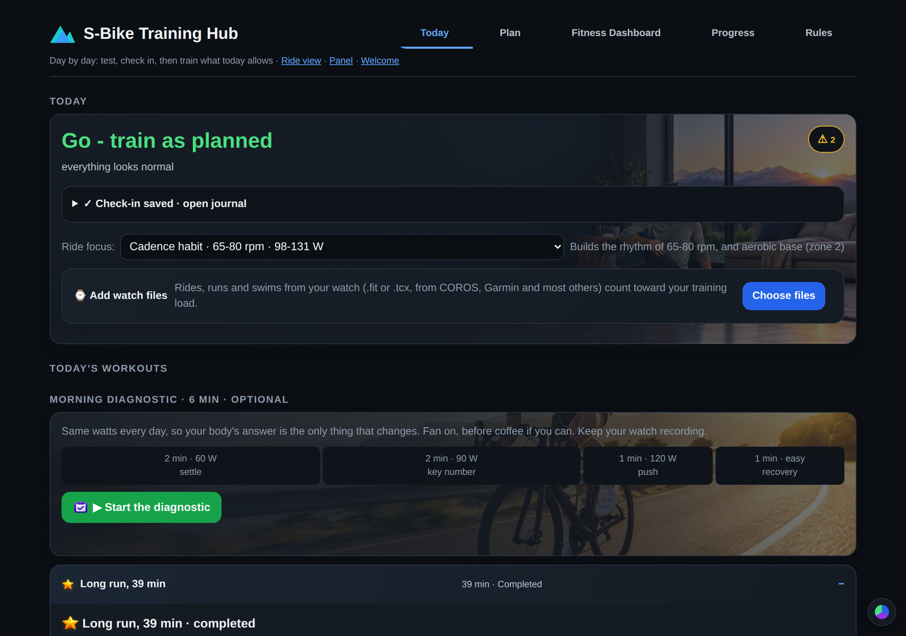</p>

## App 1.10.2 · current release

App 1.10.2 adds unfinished-workout editing and clearer swim comparisons. It includes the Windows watch-file correction from 1.10.1 and the 1.10.0 improvements below.

Workout records now share one format across sports, with editable text, optional effort readings and reports that stay linked to the original session. Watch files can be associated with scheduled workouts or added as separate sessions; linked bike and watch recordings count once. Plan uses the same **View workout details / Hide workout details** controls for every sport and stays on Plan.

**Edit unfinished workouts:** the pencil on a Today workout card reopens its warm-up, main work and cool-down fields. Save updates that workout in place, preserving completed neighbors and route settings. Completed workouts keep their original record; update their report or performed details instead.

**Energy units:** choose **Calories** or **Joules / watts** in Settings. Energy appears as kcal or J/kJ/MJ, and session rate as kcal/min or W, with a smaller equivalent alongside it. One kcal = 4,184 J; one kcal/min ≈ 69.73 W. Cycling crank power, estimated metabolic energy and nominal lifting external work retain separate labels. Changing units changes the display, not the underlying record or heart-rate zones. Lifting’s mechanical calorie equivalent is not calories burned.

**Swim timing:** type `400 FS 6 to 8 minutes` to store a six-minute goal and eight-minute expectation for the whole written set. A single time sets both markers. These are completion targets; `@ 1:10` still means a send-off, and `rest 20 seconds` still means rest. The parser previews the set totals without AI.

<p align="center">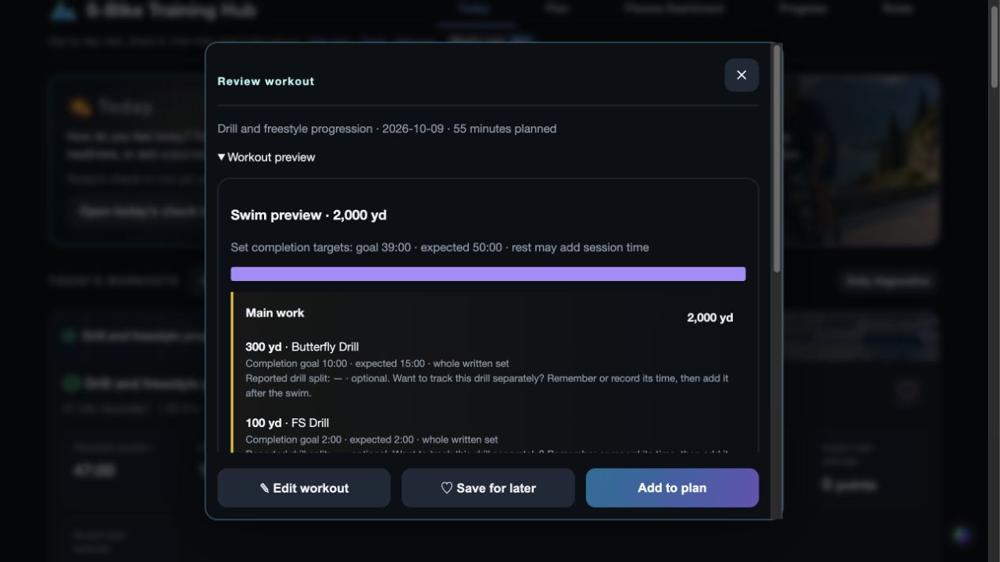</p>

After linking the watch file, distance, order and available strokes align the sets. The report shows **at goal**, **as or better than expected**, or **slower than expected**, plus seconds/percent against expectation and remaining time to goal. Consecutive drills stay one block when the watch cannot distinguish them. Missing, extra or ambiguous segments require review; no individual times are manufactured.

<p align="center">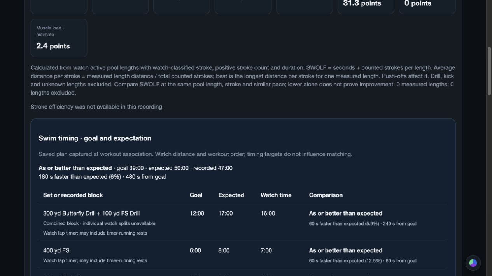</p>

Optional individual drill times are athlete reports, stored separately from watch measurements. Leave them blank if you did not record or remember them. For untimed sets, after at least three comparable recorded performances the builder offers a recent-best and median timing draft for review; it never assigns a goal silently.

<p align="center">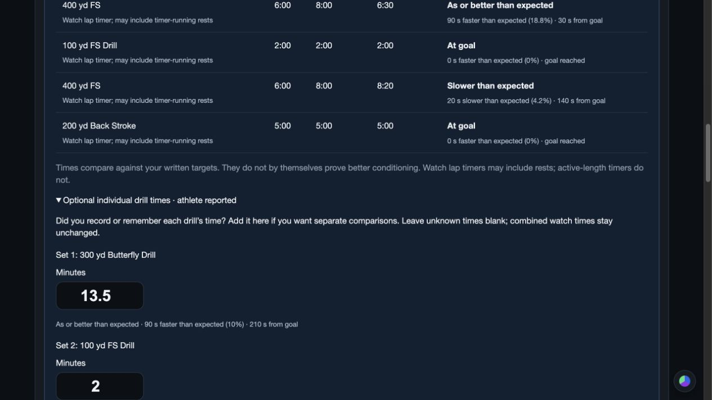</p>

Plan swim details show a sectioned workout beside a larger **distance-based stroke donut** and the credited front/back body map. The two columns align, with a separate key panel: five estimated intensity levels on the left and stroke distance on the right.

**Swim history:** closely spaced vertical columns use a fixed stroke order, with dates below. Select **Distance** for a shared metre scale or **Percentages** for full-height proportions, grouped by session or day over 5, 10, 20, 30, 40, 60 or 90 days. **Planned** uses the recorded written breakdown when available, otherwise the saved plan captured at association. **Compare** places Planned above Watch detection on the same scale. Missing written workouts stay blank; library templates are never guessed into old records.

Named drills retain their stroke color with diagonal slashes; drill/kick/pull detail can be hidden. Unknown watch drills remain unresolved. Thin absent-stroke markers mean zero and never increase totals or percentages. A distance-based swim receives a full calendar check when its prescribed distance is completed, even if it finishes faster than the estimated duration.

<p align="center">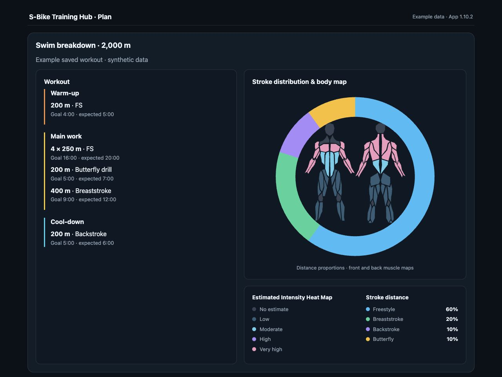</p>
<p align="center">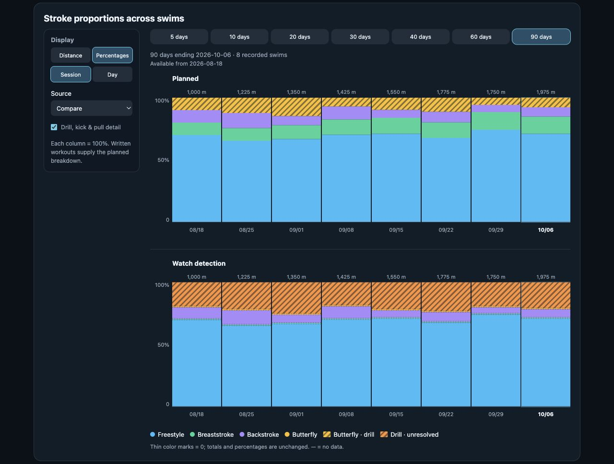</p>

Separate charts show duration, distance, average HR and descriptive HR × minutes. Increased volume can raise HR × time without raising average HR. Unknown readings remain dashes; these charts do not declare adaptation or deconditioning.

<p align="center">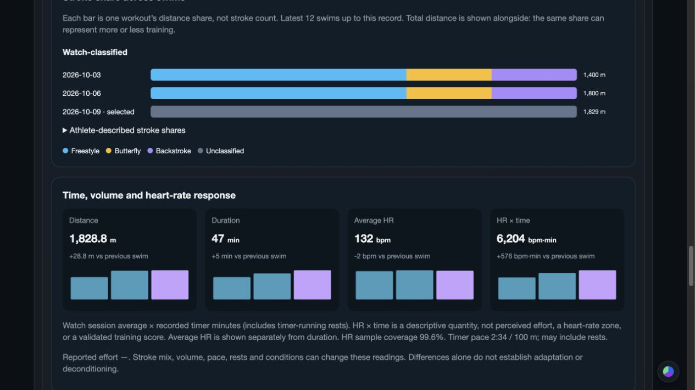</p>

**Fitness Dashboard swim history:** a full-size stacked stroke-distance chart covers custom dates or the last 1, 2, 3, 6 or 12 calendar months, grouped by day or swim session. Compare months, calendar quarters, saved training phases or custom groups of 1–12 months. Six comparison periods appear by default, three per page; request up to twelve or use View all. Each donut shows distance proportions, total distance and recorded time. Unknown classification stays visible and available-record coverage is labeled. The compact history remains in Plan swim cards; Today keeps its existing workout/report layout.

<p align="center">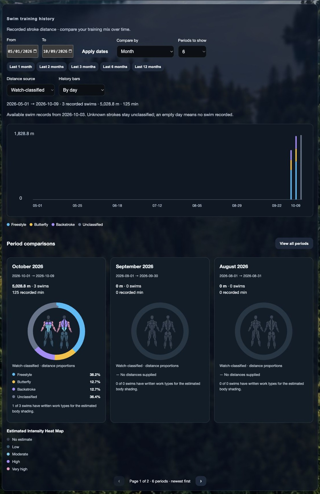</p>

Saved workouts have red library hearts. Library history opens on the most recent comparable performance, with comparison metrics above a stack of record cards and small previous/next controls. Changes in weight/reps keep a strength routine’s history; changed movements create a different routine. Performance differences alone do not prove adaptation or deconditioning.

<p align="center">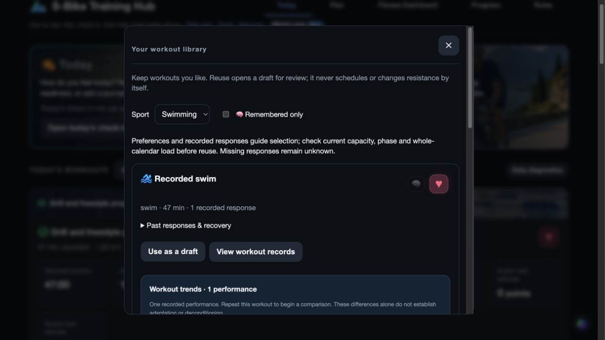</p>
<p align="center">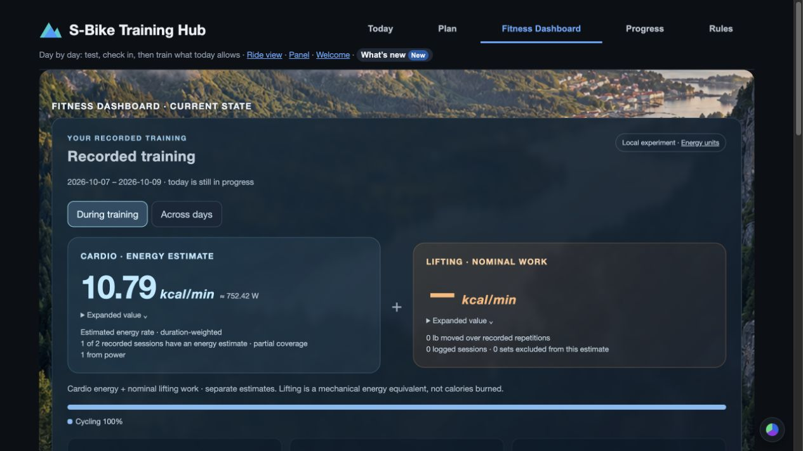</p>

Use **MCP 1.10.0** with this app: 114 listed tools use the same Hub operations as the manual interface. See [1.10.2 release notes](docs/releases/APP-1.10.2.md), [1.10.1 import correction](docs/releases/APP-1.10.1.md), [1.10.0 feature notes](docs/releases/APP-1.10.0.md). Screenshots above use synthetic data; the new swim screenshots render the actual Hub components with example workouts. The unfinished Halloween world is excluded from this release.

## What a 12-week program looks like

Meet Jordan: a fictional 36-year-old training four hours a week for a first sprint triathlon. Everything below is the real hub, run day by day with a simulated athlete:
- watch files for every session;
- morning check-ins;
- run reports;
- a busy day, a head cold, a sore shin and a pinching shoulder.

Nothing on these screens was drawn by hand; it's what the hub calculated.

**Week 1 is a test week:**
- an FTP ramp test;
- a timed swim;
- a strength familiarization;
- the **running calibration**: up to an hour in zone 2.

Jordan stopped at 40 minutes, tired, and said so. After eight days without running and with clean mornings, the hub set the running block from that run. The program starts well below Jordan's four hours, because available time is a ceiling to grow into, not a starting dose.

<p align="center">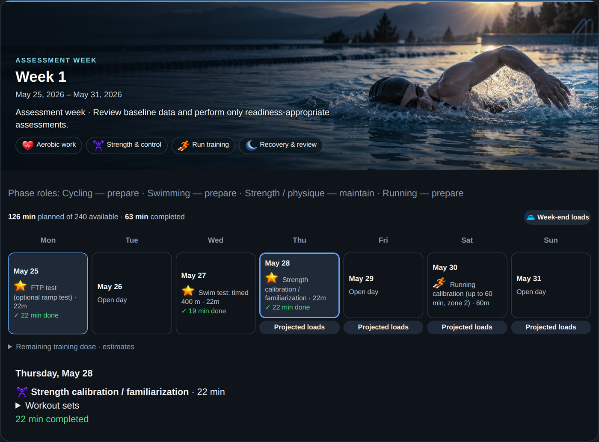</p>

**Week 6: life happens.**
- **Missed sessions:** a red ✕ and a reason (busy, sick, sore…).
- **The shin:** after Jordan reported a sore shin, running went on hold and then came back in gradually. The assistant swapped the affected sessions and said why.

<p align="center">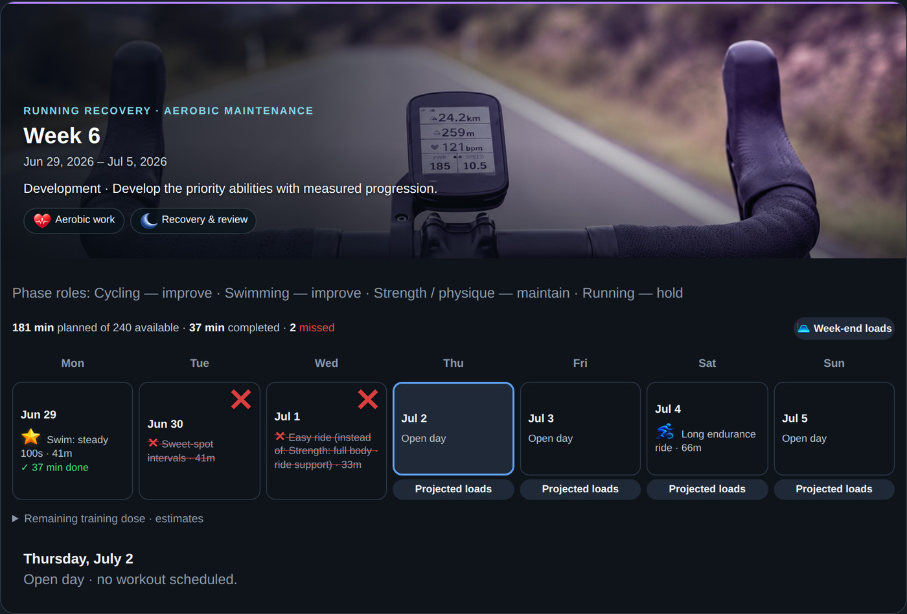</p>

**Week 8: a check week.** A deload that retests everything: FTP, a strength check (one comfortable set per lift), and a full-hour running calibration. Jordan is fitter now, so the running block was re-measured bigger. A 12-week program gets two check weeks, a 16-week one three, and a year eight, the last three close together before the peak.

<p align="center">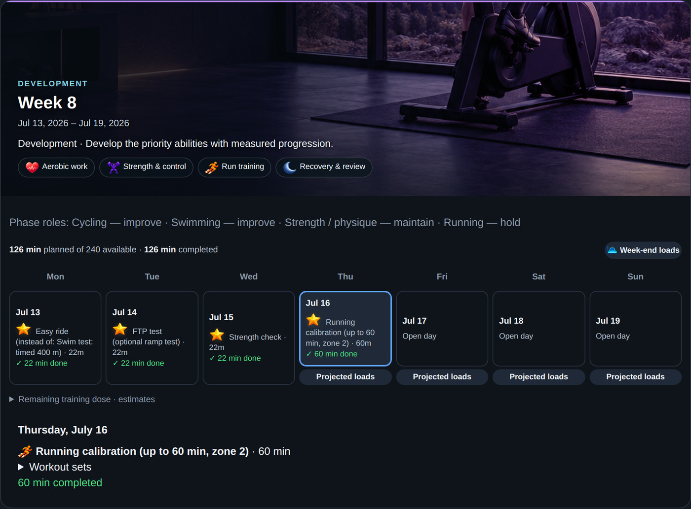</p>

**Week 10: event preparation.** A different shape from the volume peak: race-pace swim and ride intervals, a long run, and bricks (a run straight off the bike).

<p align="center">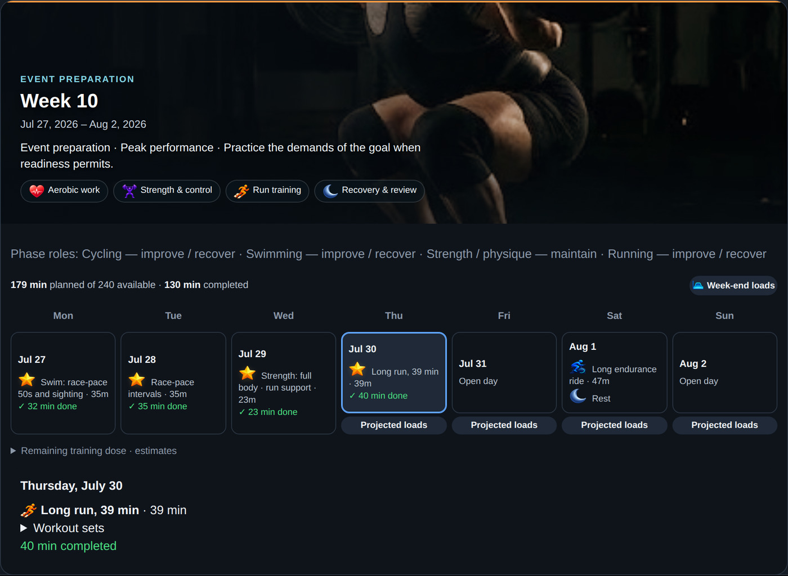</p>

**Week 12: race week.** Short openers, quiet days, and race day on the calendar.

<p align="center">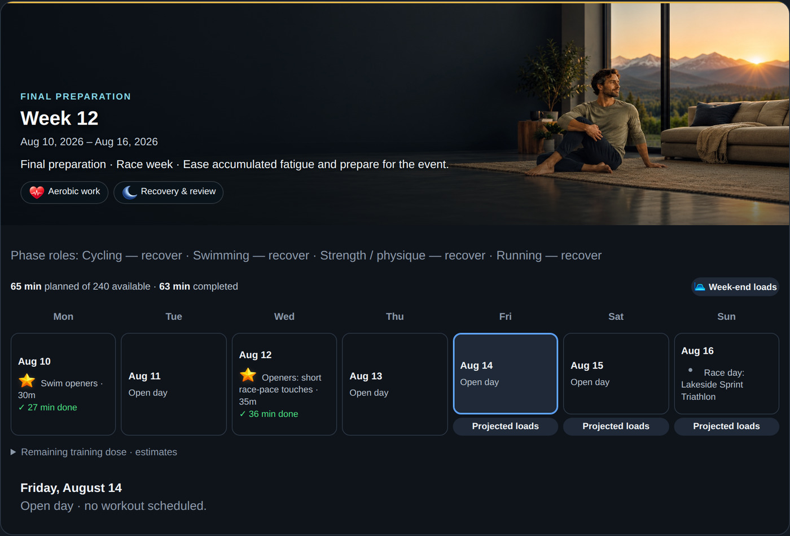</p>

<p align="center">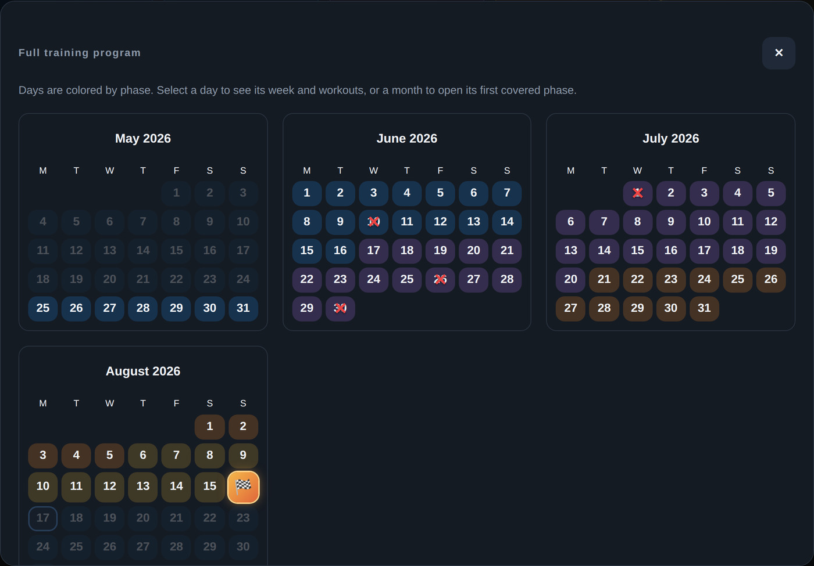</p>

To make your own copy of this journey: `python3 tools/demo/journey.py` (Linux, needs `faketime` and Playwright; `--from week06` replays from a save point).

## Ride views and personal media

The ride screen shares its controls across the existing ride views. The phone layout has a compact cadence display; tap for ride information. Workout targets stay the same when the view changes. Pause, resume and End operate on the current ride, workout and route; route/ghost history tolerates incomplete event rows.

Personal audio and video use one **private folder on your computer**, configured in **Settings → Music connections**. Choose a folder on macOS; on Linux/Windows use `HUB_MUSIC_FOLDER`. The Library separates audio/video, supports search and random selections, shows available cover art and tempo, and plays supported files with seeking. Choose video opens the Video library. Uploads never overwrite existing files. Setup is restricted to the computer running the Hub; paired devices can play the media. The previous third-party streaming-service setup is removed from this release.

See [personal media setup and privacy](docs/PERSONAL-MEDIA.md) for account setup, supported formats, and what stays local.

## Set it up

You need **Python 3.11+**.

### 1. Install

**macOS** (everything, including the bike bridge, menu-bar icon, route planner and 3D maps):

```bash
git clone https://github.com/JHarp199345/S-Bike-Training-Hub.git
cd S-Bike-Training-Hub
./setup.sh              # everything, with a smart bike and maps
./setup.sh --no-maps    # the bike bridge without route maps
./setup.sh --no-bike    # no smart bike: the coach, training load, lifting and the dashboard
```

**Windows 10/11** (download the repository as a ZIP, or clone it, then in PowerShell in that folder):

```powershell
powershell -ExecutionPolicy Bypass -File setup.ps1           # the hub and the bike bridge
powershell -ExecutionPolicy Bypass -File setup.ps1 -NoBike   # no smart bike
```

**Linux:**

```bash
./setup-linux.sh             # the hub and the bike bridge (needs BlueZ: sudo apt install bluez)
./setup-linux.sh --no-bike   # no smart bike
```

Setup creates the Python environment, installs what it needs and makes a launcher: **S-Bike Hub** on your Desktop on macOS and Windows, `./s-bike-hub.sh` on Linux. Your browser opens the hub at <http://127.0.0.1:8729>, starting with the **welcome page**.

Linux setup now installs the route planner and 3D map tools; regional data downloads ask first. Java is required for route planning. Use `--no-maps` to skip map tools. Windows map setup and physical bike/watch verification on Linux and Windows remain pending. Automated installation and simulated-device tests run in GitHub Actions.

### 2. Tell it about you

On the welcome page, under **Set yourself up**:
- **About you:** your sports and experience in each, body weight and heart rates.
- **Your running:** do you run now? Pick how much running you'd like (or do) in a week. 40 minutes is about one good run; the choices go from 20 minutes to 140+. If you already run, also say how many runs. A new runner starts a little below what they pick; someone who already runs continues their usual week and holds it for two weeks. Mention any pain or niggles. The **running calibration** in your first week then measures it properly.
- **Your rules:** plain sentences that steer every workout: *"I can't do pull ups"*, *"No barbell deadlifts"*, *"No BB squats"*, *"No barbell work the day before a long ride"*. An excluded lift is swapped for the next option, never dropped. An equipment word narrows a rule: "No barbell deadlifts" still allows dumbbell Romanian deadlifts.
- **A running injury:** if you're coming back from one, tick that box. It turns on a more careful return-to-run protocol.

Then **Build my program**: the hub drafts a program toward your goal that you can preview and edit before applying: test week, foundation, development, event preparation, taper and race week. Your lifting split is your choice: full body, upper/lower, push/pull, push/pull/legs, or knee/hip/push/pull.

### 3. Connect your AI assistant (optional, recommended)

The hub keeps the numbers; your assistant plans with you. It works with any app that supports MCP servers: Claude Desktop, Claude Code, and others, including local models.

- **Claude Desktop:** use MCP **1.10.0** with this updated app. Download the `.mcpb` bundle from the [latest release](https://github.com/JHarp199345/S-Bike-Training-Hub/releases), then **Settings → Extensions → Advanced settings → Install extension**. Leave the hub address at `http://127.0.0.1:8729`.
- **Claude Code:** `claude mcp add --scope user s-bike-hub -- "$PWD/.venv/bin/python" "$PWD/mcp_server.py"` (on Windows: `.venv\Scripts\python.exe`).
- **Other MCP apps:** point them at `mcp_server.py` with the `.venv` Python.

Then talk to it: *"How am I doing this week?"*, *"I missed Tuesday, I was sick"*, *"Plan next week around a work trip"*. To start the day, use the **daily-check-in** prompt.

### 4. Connect your bike (optional)

On the welcome page, under **Your bike**: turn the bike on, pedal to wake it, disconnect it from any phone or watch app, and press **Scan for my bike**. Then click your bike in the list.

<p align="center">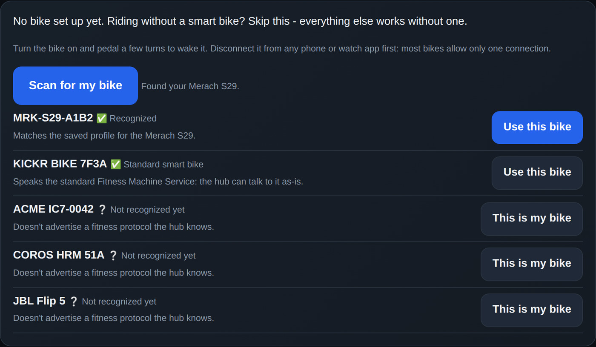</p>

- **✅ Recognized** (like the Merach S29) or **✅ Standard smart bike** (most bikes made since about 2020): click **Use this bike**. Done.
- **❔ Not recognized yet:** click **This is my bike**, and say yes to *"May the hub ask your assistant to set this bike up?"* The hub listens to the bike for a few seconds, then shows:

<p align="center">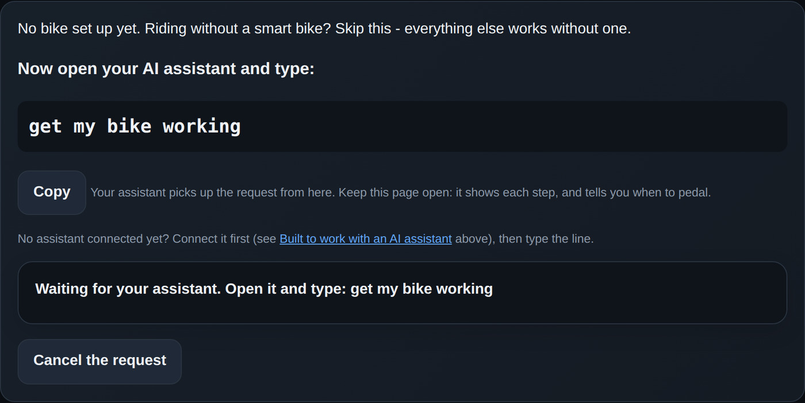</p>

  Open your assistant and type **get my bike working**. It confirms the bike with you, asks you to pedal at a couple of speeds, writes a bike profile (settings, never code), and runs a short guided check while you pedal. The hub enforces the safety rules itself: no resets, no resistance 0, only small steps within the bike's range. If it can't work out the resistance command, the bike still works for power and cadence. Details: [docs/bike-setup.md](docs/bike-setup.md).

### 5. Get your watch data in

Use **Import watch workout** on Today for `.fit` or `.tcx` files (COROS, Garmin and other supported watches). Choose the matching scheduled workout, or **＋ New workout** for a separate session on the watch’s recorded date. Preview the association before saving. A watch file can also link to a Hub bike recording: bike power/cadence and watch heart rate are aligned with an optional clock adjustment and counted as one session. Imports preserve existing files and detect duplicates. Assistants use the same review and save operations.

## Every day

1. **Check in** on **Coach → Today** or with your assistant: legs, feet, sleep, the hop test on run days, and a journal line if you want.
2. **Go through the "needs attention" list together.** Every check-in returns a short list for the coming week, most urgent first. Your assistant proposes the lightest fix for each item, shows you the change, applies it once you agree, and tells you what changed (or that the plan stands). The list can include:
   - a rule a session would break;
   - a session forecast over a limit;
   - a running deload starting or ending;
   - a test waiting for an answer;
   - a missed session without a reason.
3. **Train** what today says. After a run, say how it felt: that's how your running block learns.
4. **Sunday check-in**: a minute on how the week went.

## What's under the hood

- **Training load for every sport**, split by body system:
  - heart and lungs;
  - muscles;
  - impact on feet and bones, from your steps, pace and body weight;
  - swim shoulders;
  - lifting by muscle region.
- **Running response and recovery review:** recent reports and recorded exposure guide the selected response estimate. Shared model changes require an evidence-based preview and approved apply; older block tools remain for legacy installations. The estimate is not an injury prediction or medical clearance.
- **Training rules** checked on every plan and change:
  - no hard ride or run the day after leg lifting;
  - no two sessions on the same tissue in one day;
  - lifting regions get 48–72 hours;
  - hard sessions of a sport stay 48 hours apart;
  - plus a few more.
- **Lifting sessions:** 2 main lifts + 3 minor ones, with sport-specific support work and rotation and anti-rotation core. Phases set the reps and effort, never to failure.
- **Your data stays on your computer.** Nothing is uploaded unless you share it with an assistant or post to Strava yourself.

The coaching rules in detail: **[docs/coaching-review.md](docs/coaching-review.md)**. The full reference (every model, formula, assumption and page): **[docs/how-it-works.md](docs/how-it-works.md)**.

## With a smart bike

Built on, and tested with, the **Merach S29**. The hub holds the bike's one Bluetooth connection and shares it with your watch and with apps like Kinomap. It also:
- turns hills into resistance;
- adds virtual gears and auto-shifting;
- runs ERG workouts that back off when you tire;
- rides offline 3D routes;
- gives you a phone remote on the handlebars.

See [docs/how-it-works.md](docs/how-it-works.md#connected-cycling).

## Development

```bash
python tests/run_all.py     # every test; macOS-only tests are skipped elsewhere
```

Tests run on Linux, macOS and Windows in GitHub Actions on every push, installing with each system's setup script. The demo journey lives in `tools/demo/`.

## ⚠️ Safety

The training models are provisional estimates calibrated by your own reports, not medical advice or injury prediction. Check with a doctor before starting a program, and stop if something hurts. Shortness of breath or a heart-rate issue is a reason to ease off all training and get checked. The bike connection changes resistance on real equipment: keep a way to stop pedaling safely.

## Personal music and video

A private folder supplies audio and browser-playable video during rides, with local metadata and tempo reading where available. The current library deals 36 random picks and supports search, audio/video selection, and shuffle. Playback depends on the browser and codec; the Hub does not transcode files. See [personal media setup](docs/PERSONAL-MEDIA.md).

**In progress:** testing more formats and richer metadata browsing. The planned recommendation layout is 16 feature films and 32 music videos, organized by genre, director and participating artists. Those category-specific counts and filters are not implemented in this release.

## Credits and license

The **Fitness Dashboard body heat map** uses [body-highlighter](https://www.npmjs.com/package/body-highlighter), derived from [react-body-highlighter by GV79 / giavinh79](https://github.com/giavinh79/react-body-highlighter), under MIT. Its [original license](web/vendor/body-highlighter.LICENSE) and [upstream documentation](web/vendor/body-highlighter.README.md) are included. The swim donut reuses the same credited front/back body map at a smaller scale.

Thanks also to [MapLibre](https://maplibre.org), [BRouter](https://github.com/abrensch/brouter), [Protomaps](https://protomaps.com), [OpenStreetMap contributors](https://www.openstreetmap.org/copyright), [Kenney](https://kenney.nl) and [Quaternius](https://quaternius.com) for the software, map data and art used by the Hub. Existing scenery asset licenses and credits remain bundled. These are project credits, not claims of sponsorship or partnership.

Built by JHarp199345 with [Claude](https://claude.com) as co-author. The running-load block model was worked out by JHarp199345 with ChatGPT, then built into the hub with Claude. Map data © OpenStreetMap contributors; full credits in [docs/how-it-works.md](docs/how-it-works.md#credits). [MIT license](LICENSE).

### Workout reports and purpose

Completed lifting sessions support **Too easy**, **As intended**, and **Too hard** reports in Today and Plan, with visible save confirmation. Today shows the saved workout steps; Plan explains the workout’s purpose, phase and neighboring sessions. Test cards explain what each assessment measures, how it runs and what to record afterward. During check-ins the assistant reviews explanations against the saved plan and forecasts, updating only stale or misleading text. Explanation updates preserve the workout dose and recovery rules.

### Update history

Open **What’s new** in the Coach header for dated release milestones, artwork, and links to the wiki. **Check for updates** reads the public GitHub update list; optional automatic checks run when you open the Hub, at most twice a day. They send no athlete records and never install updates automatically. Older installs need to update once to gain this checker.


### Write or import a swim workout

Use **Add workout → Swimming** to enter warm-up, pre-set/drills, named main sets, and cool-down. The preview totals yards or meters and preserves repetitions, strokes, equipment, send-offs and fixed rest. `6 × 50 kick @ 1:10` means starting a 50 every 70 seconds; it does not mean resting 70 seconds. Enter the full session time when some sets have no timed interval.

**Import workout file** reads PNG/JPEG/WebP images, screenshots, PDFs (up to six pages), and UTF-8 text or Markdown. The local reader keeps the original and fills the workout fields directly. Those fields are the editable transcription: compare distances, repetitions, units and times with **View original**, then press **Continue**. Swimming shows one structured preview; **Edit workout** reopens the fields. Handwritten workouts can be uploaded, but recognition may need corrections or your AI assistant's visual review. With permission to read that source, the assistant can use `get_workout_import` to inspect a page, then `preview_swim_workout` before saving an approved prescription. Imports are drafts, not completed workouts, and never record activity load by themselves.

#### A swim resource the creator uses

[GoSwimFast's training hub](https://goswimfast.com/training) offers a workout library and a generator. The Hub's creator uses it occasionally for structured swim workouts when he does not want to write one from scratch. This is an independent personal recommendation, not an official integration or a claim of partnership. Bring a workout you are permitted to use into the Hub, then review it against your own program and current condition.


### One ride screen, your choice of scenery

**Ride view** keeps Today, the training plan, Plan a ride, Fitness, Progress and Settings accessible. Choose real 3D maps, the animal game, its 8-bit version, or the 3D haunted graveyard from the **Ride menu**; check **Default** to remember the view in this browser. Changing scenery preserves the active workout or route. Workout watts or route grades still drive the bike; the scenery does not create a second workout or recorder.

In **Plan a ride**, save or import a route, select **Show**, choose a training date and planned duration, then **Add route to training plan**. That prescription contributes to projected load. Riding a route or power workout uses the existing Hub recording pipeline; imported watch recordings are reconciled with bridge recordings to avoid counting the same ride twice. Route time is a planning target, not a guaranteed completion time.

The graveyard is a winding 3D course with a following rider camera, crypts, moonlit woods, ghosts and scripted roadside encounters. Kenney’s CC0 Graveyard Kit supplies reusable scenery and character animations; Three.js renders them locally. **Explore scenery** runs a visual tour without starting or recording a workout. See [asset credits](web/graveyard/CREDITS.md).

### Structured running entry

Choose **Running** and a **Run / walk**, **Steady run / jog**, or **Speed intervals** format. The examples fit running rather than lifting. Enter stages such as `6 x (2 minutes jog zone 2 / 1 minute walk)`; the local parser preserves their order and builds an AI-free preview. Optional targets include distance, steps, a personal watch zone, and a heart-rate range.

Distance-only stages need time or pace to estimate steps. Impact exposure uses the existing Hub model when distance, time and body weight are available; otherwise it remains incomplete or uses the forecast's explicitly provisional duration prior. Assumed cadence is identified. These prescriptions remain subject to the current running gate and completed workouts are protected. The MCP source exposes `preview_run_workout`, `save_run_workout`, and `schedule_route_workout`.

### Live previews, workout goals and favorites

Previews do not require AI. Cycling keeps its text fields and effort graph together; the parser recalculates after typing pauses. Swimming follows **upload or write → review fields → Continue → preview**, with **Edit workout**, **Save for later**, and **Add to plan** as separate actions. Uploaded source files stay local unless a connected AI client explicitly requests them through its tools.

Strength accepts an optional **total external weight moved** target in pounds or kilograms. Its preview totals sets × reps × entered weight across warm-up, main work and cool-down; unilateral sets count both sides when specified. Static holds and body weight are excluded from moved weight. Session time is optional for strength and is estimated for scheduling when omitted. Total moved weight checks volume; it does not replace the existing effort, tempo, muscle-region and recovery calculations.

Swimming can have distance and time goals. Cycling can have time, an average-power range for main work or the whole session, distance, and energy goals. Interval lengths may vary; average power is duration-weighted. A power prescription alone cannot verify road distance or metabolic calories, so those targets remain unresolved until an appropriate model or observations are available. Goal differences and unresolved targets require explicit review before saving.

**Save goal brief without a workout** stores a dated request for a coach or assistant to design or reuse suitable work within the current phase. It carries no projected or recorded activity load. A saved prescription can resolve its brief. **Save for later** hearts a workout in the private library without scheduling it; workouts added through the creator are also kept for reuse. Heart buttons on scheduled workouts keep favorites. Library entries show explicit effort reports, original completion records when matched, and delayed recovery feedback when available. Missing feedback is shown as unknown. Edited prescriptions and repeated dates do not silently inherit another workout’s response.

The MCP server provides compact `get_workout_library` listings, `get_library_workout` details, `get_workout_goals`, `save_workout_goal`, `preview_workout_goals`, `save_library_workout`, and `favorite_workout`. Its coaching routine considers compatible favorites before inventing every workout, previews goal differences and whole-calendar load, and preserves the current program’s recovery and taper purpose. Preference is not readiness clearance. These tools ship in MCP 1.10.0; update older extension bundles and restart the Hub to expose the new actions.

### Energy display

**Settings → Training display → Energy units** switches recorded training totals, energy history and the plan’s load outlook between **Calories (kcal)** and **Joules & watts (J / W)**. Calories are the default; the choice is saved in this browser. “During training” and completed workout reports show **kcal/min** in Calories mode and **estimated metabolic power in watts** in Joules & watts mode, with the equivalent in smaller text beside the value. This is the existing energy estimate divided by recorded session time, including recorded rests; measured cycling power stays separate. Lifting’s nominal work is a mechanical energy equivalent, not calories burned.

Find completed metrics in **Plan → workout date → recorded session → View reported workout**, or **Fitness → Recorded training → Recorded sessions by sport**. Today shows the same report for activities completed that day.

### Missed work and plan adjustments

Cancel (✕) keeps the original workout’s sport icon, duration and prescription with a red X. It contributes no remaining planned load and can be restored. On a finished day with no recorded training, a separate **Recovery day · no training recorded** entry appears alongside missed or cancelled workouts. This describes the record, not measured physiological recovery.

**Plan → Plan follow-through** separates completed, partial, cancelled and missed sessions from revisions to the prescribed target. Cancelled work remains in the completion denominator. Revisions retain before/after prescriptions and the first observed target; earlier edits are unknown. The usual Hub save boundary captures changes made through the app or MCP. The read-only MCP `get_schedule_adherence` tool exposes the same accounting. Adherence describes execution; reports and later performance establish how training went. Athlete records and tracking history remain in the private, ignored `coach.json`.
